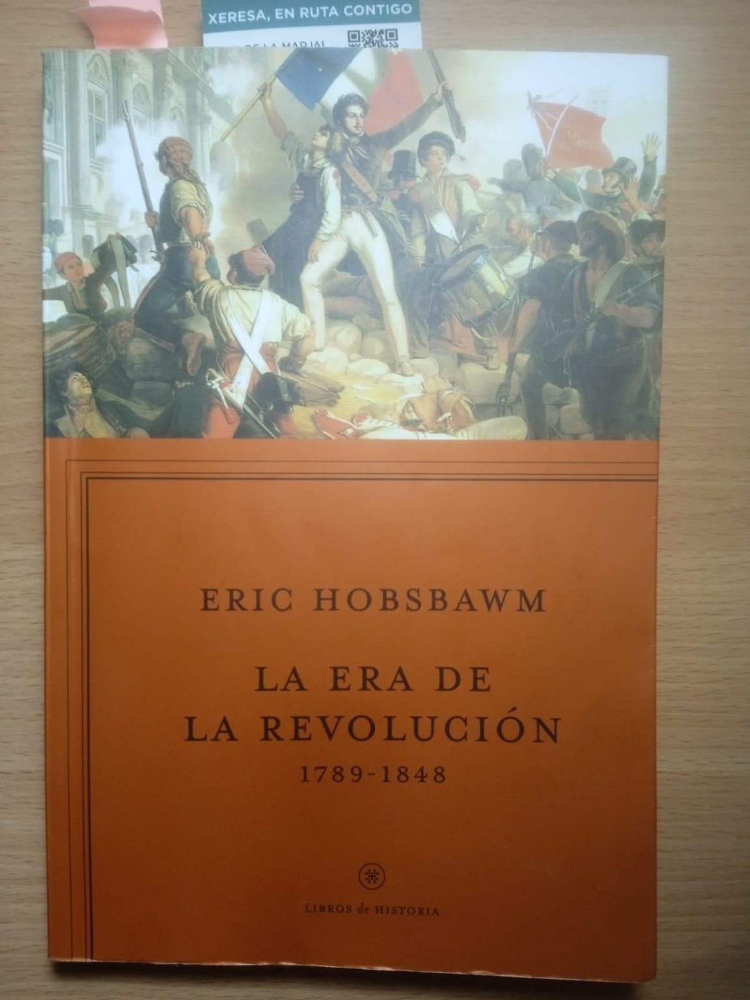

---
title: "LA ERA DE LA REVOLUCIÓN. 1789-1889"
author: "Tomàs Ferrandis Moscardó"
date: "2023-01-01"
output:
  html_document:
    toc: true
    toc_float: true
    toc_depth: 4
    df_print: paged
    number_sections: false
  word_document:
    toc: true
  pdf_document:
    latex_engine: pdflatex
    toc: true
    keep_tex: true
---

# 1. INTRODUCCIÓN

En el presente trabajo analizaremos el libro “La Era de la revolución: 1789-1889” de **Eric J. Hobsbawm**. Un ensayo sobre la “doble revolución”: la Revolución francesa y su contemporánea revolución industrial inglesa. El libro, como indicó su autor, no pretende ser una narración detallada sino una interpretación del impacto de la doble revolución visto desde una óptica franco-inglesa.

Nuestro trabajo no es un resumen del ensayo por lo que no hallaremos una correspondencia directa de epígrafes con capítulos o secciones de aquél. La estructura de nuestro texto responde a lo que entendemos como las generalizaciones o las aportaciones más interesantes del autor incluyendo también alguna observación o crítica. 

Así pues, los dos primeros apartados tratarán las revoluciones, la industrial y la francesa. El punto siguiente lo hemos dedicado a tratar la herencia de ambas revoluciones, sobre todo en las revoluciones posteriores y, posteriormente concluimos con un epígrafe donde resumiremos las ideas principales del ensayo no sin antes dedicar un apartado específico para abordar la invisibilidad de la mujer en el libro. 

Para contrastar o ampliar el punto de vista del autor hemos recurrido a la consulta de libros y alguna publicación que detallamos en el apartado de Bibliografía. Dada la extensión limitada del trabajo, se han tenido que omitir algunos comentarios sobre apartados interesantes del libro centrándonos en los cambios sociales y económicos que globalmente dejó la industrialización y la expansión de las ideas de la Ilustración.

{width=250px}

# 2. LA REVOLUCIÓN INDUSTRIAL

Como introducción nos hacemos eco de unos datos iniciales que aporta Hobsbawm. El autor data el inicio de la revolución a partir del despegue de las cifras estadísticas sobre economía (*trade-off*) en 1780 mientras otros autores lo sitúan en 1760 (McCloskey, 2020:50). Nos aclara también que el término “Revolución Industrial” fue una invención posterior de los socialistas ingleses y explica el recelo de los historiadores conservadores que preferían el nombre de “evolución acelerada”.  

**Del Despotismo Ilustrado al *putting-out***

Cuando Inglaterra ya tenía su revolución hecha en el siglo anterior, las Monarquías Absolutas de Europa concedían algunas modernizaciones para contentar al tercer estamento. Estos Monarcas ilustrados y “planificadores” pensaban en su poder y los ingresos del Estado sin creen en la transformación social que exigía la economía. Pertenecían a la feudalidad y así mantuvieron la servidumbre de los campesinos a excepción de Dinamarca y Saboya como prueba de ello.

En Inglaterra, en cambio, apareció la figura del empresario agrícola y sí hubo una cosecha comercial. Se implantó el *putting-out* y, más adelante, cuando el mercader proporciona herramientas o material, aparece la especialización y la división del trabajo.

El mercader era la figura principal de este capitalismo incipiente. El “industrial” (el término no existía todavía nos aclara el autor) apenas era un manufacturero. Este desarrollo agrícola a partir de la segunda mitad del siglo XVIII, se ve acelerado por el incremento de población, el desarrollo urbanístico, comercial y de manufacturas.

## 2.1 ETAPAS Y FERROCARRIL

En la revolución industrial, atendiendo a los movimientos económicos de la burguesía, Hobsbawm diferencia dos etapas.

La primera etapa se caracterizada por una actividad “industrial” basada en la inversión moderada: comprar barato y vender lo más caro posible. Aún no había una mecanización tal que redujese el coste para no depender de la demanda. Esa aceleración no era imaginable, pero los cimientos estaban puestos según el autor.

El industrial nuevo era un pequeño empresario, los grandes capitalistas no invertían en industria, las innovaciones técnicas (telares, husos…) eran perfectamente escalables por lo que, con la ampliación del mercado y la inflación continua, se pudo aumentar la capacidad de producción.

Europa no sólo tenían la mirada fijada en los acontecimientos políticos de Francia. Hobsbawm advierte que los ministros y funcionarios de las monarquías ilustradas estaban dedicados al “desarrollo económico” sin logros destacables y por ello, concluye que la Revolución inglesa es uno de los acontecimientos más importantes de la la humanidad.

La segunda etapa arrancaría a partir de 1840 con la llegada del ferrocarril. El capital acumulado por la burguesía fue invertido, en un afán especulativo, en la construcción del ferrocarril (la cultura de las capas medias era más adecuada que la de la aristocracia feudal). Esto provocó un despegue y transformación de la industria pesada en Inglaterra (hierro, carbón y maquinaria) similar a la de la industria del algodón. 

A partir de 1783 se intensifica el comercio de algodón y esclavos entre Europa (Inglaterra) y las colonias americanas. El autor describe una sociedad estratificada en grandes funcionarios y financieros; nuevos profesionales gracias al mundo agrícola y el industrial que era el “pariente pobre” de mercader. 

El ferrocarril es hijo de la mina inglesa pero lo crio la acumulación de capital y ambición de la burguesía.  Hobsbawm, destaca el carácter privado del ferrocarril inglés a diferencia del resto de Europa. En España, por ejemplo, hubo rescates y concentraciones hasta 1941.

## 2.2 FACTORES

**Inferioridad en ciencia y técnica.**

El éxito no se debió a una superioridad técnica o científica. Los franceses superaban a los ingleses en ciencias e innovación, una mentalidad más abierta, la Escuela Politécnica y buenos hacendistas y fisiócratas. En cambio, los ingleses tardaron en crear la educación primaria, sus universidades eran peores y como sociedad eran más reaccionarios frente a las ideas nuevas. Esta es una de las conclusiones generales del autor frente a los que defienden que “la innovación provocó la Revolución industrial” (McCloskey, 2020: 141).

De hecho, nuestro historiador se sorprende de la falta de educación formal para tanta actividad manufacturera. El éxito se basó más en las pequeñas innovaciones artesanas de carpinteros y manufactureros frente a los inventos técnicos que fueron modestos.

**Problema agrario resuelto.**

La ventaja fundamental de los ingleses era haber solucionado antes que nadie el problema agrario. La nueva estructura social de terratenientes comerciales, arrendatarios manufactureros y empleados pudo cumplir con las demandas de la industrialización:  alimentar una mayor población, aportar población para las ciudades e industrias, acumular capital para nuevos sectores, crear un excedente para exportar y un nuevo mercado rural.

No hubo revolución tecnológica hasta 1850 en el campo. La generalización de los métodos de racionalización y expansión de las áreas de cultivo descubiertos antaño fue suficiente (cercamiento, rotación de cultivos...)

**Elevado coste humano y éxodo rural**

El éxito costó mucho sufrimiento humano y éxodo rural que benefició a la industrialización. A la ciudad llegaba mano de obra inexperta que el patrono trataba con disciplina draconiana y siempre que podía contrataba mujeres o niños que cobraban menos.

**Capital** 

Respecto al capital, los primeros industriales disponían de poco y por ello eran tan duros con sus trabajadores. Los que disponían de capital aún no invertían en industria.

Los bancos y el comercio exterior estaban preparados y la legislación, distinta a la continental, se iba adaptando al capitalismo si bien, en principio era un cúmulo de problemas, la improvisación fue la clave.

**Coyuntura ideal.**

Toda Europa imitó e importó la técnica y capital inglés. Pero Inglaterra tenía una industria y coyuntura económica ideal para liderar la Revolución Industrial: la industria algodonera y la expansión colonial.

Además de esta economía fuerte, era un Estado agresivo que había eliminado a su rival (Francia) y solo tenía en frente a los nuevos EEUU. Aquí vemos una idea criticable a Hobsbawm: la agresividad del gobierno británico era por razones de economía, entendida como ésta progreso social, casi como una justificación. Cuando se trata de otros imperios habla más claramente de expolio y ocupación.

El comercio colonial creó la industria algodonera y el tráfico de esclavos. La exportación de algodón entre 1750 y 1769 aumento más de diez veces, llegar primero al mercado era el objetivo principal y disparó el interés por arriesgar en innovaciones técnicas.

**El triunfo del mercado exterior sobre el interior.**

Inglaterra, a causa de las guerras, revoluciones en otros países y su política imperial, se impuso en América Latina además de sus colonias. Se pierde el interés en los productos de algodón de las Indias Orientales y se desindustrializa la India que pasa a ser cliente de la industria inglesa. China continúa cerrada en la autarquía hasta que los comerciantes ingleses empiezan a exportar opio ilegalmente.

## 2.3 REVOLUCIÓN SOCIAL

La transición a la nueva economía creó miseria en la clase trabajadora urbana, había alzamientos espontáneos que posteriormente dieron origen a las revoluciones de 1848. También el comerciante, pequeño patrono y granjero compartía esta indignación contra los rentistas que, gracias a los salarios bajos, disponían del capital para las inversiones.

Aunque la innovación consistía en pequeñas adaptaciones, no en grandes revoluciones técnicas y quedó estable en 1830, se produjo una sustitución de obreros no especializados por expertos mecánicos y máquinas lo que aumentó más el desempleo.

Los salarios bajaron, según la lógica cruel de la ley de la oferta y la demanda hasta el límite del hambre. El precio del pan pasa a ser el problema central y la reacción contra un parlamento dominado por terratenientes que establecía precios mínimos en los precios de cereales. Aparece así la liga Anti-Corn Law entre 1838-1846.

## 2.4 CONSIDERACIONES

**Liberalismo e intervencionismo**

En lo referente a los factores y el análisis sobre el desarrollo de la revolución industrial, Hobsbawm, si bien coincide con pensadores liberales actuales al señalar la emancipación del campesino y el libre comercio de excedentes como desencadenante, choca con éstos cuando atribuyen a la “innovación” y la ausencia de intervención del Estado el logro final. La rigidez legal a la que nuestro autor achaca todos los males era la propia del feudalismo: la servidumbre. De hecho, afirma que ni la abolición de las Corn Law ni una libre importación bajan el coste de la vida, aunque no lo argumenta y critica los excesos de la “ley de la oferta y la demanda”.

**La mujer trabajadora**

El historiador nos describe la emigración de población rural hacia el creciente mundo urbano e industrial y la preferencia de los patronos en contratar mujeres y niños puesto que se les pagaba un sueldo inferior. 

Como bien expone Joan W. Scott la mujer ya trabajaba fuera del hogar antes de la industrialización, no obstante, la figura de la mujer trabajadora (de la que Hobsbawm se olvida completamente) es un producto de la revolución industrial no por qué la mecanización creara sus puestos de trabajos sino porque en el transcurso de la misma se convirtió en una figura problemática y visible. (Scott Joan W. 2000: 428)

Debe resaltarse la omisión por parte de Hobsbawm de todo lo concerniente al debate sobre la sustitución de la productividad doméstica de la mujer por la fabril. Debate que se extendió más allá del siglo XIX. Menos interés ha despertado el activismo de tantas mujeres antes incluso de la organización del movimiento sufragista. Desde la cooperación en las campañas contra la Ley de los Cereales, congresos contra el esclavismo o causas directamente vinculadas a derechos de la mujer y los niños como la custodia de los hijos, la propiedad de la mujer casada, acceso a la universidad o ejercer profesiones como la medicina u otro de rabiosa actualidad como la abolición de la prostitución que podemos encontrar como defiende en sus memorias Millicent Garret Fawcett (Garrett M, 2019: 36). 

**La India**

Hobsbawm habla de la desindustrialización de la India y de la pérdida de interés en el algodón de la India como algo casual más que causal. En la actualidad muchos historiadores hablan abiertamente del saqueo de la India por medio de la Compañía de las Indias Orientales y “el factor crucial fue, probablemente, el apoyo que el parlamento británico proporcionó[...] lo que hoy podríamos denominar un consorcio público-privado” (Dalrymple, 2021: 27).

En lo referente a la exportación de opio a China lo determinante fue el interés del gobierno inglés en compensar el déficit comercial producido por la demanda inglesa de porcelana, te y seda de China. El interés público de reducir la cantidad de plata que les costaba este déficit estaba por encima de las “provechosas actividades que los hombres de negocios europeos deseaban iniciar” como lo define el autor (Hobsbawm, 2011a: 114). 

# 3. LA REVOLUCIÓN FRANCESA

El siglo XVIII es el fin de un régimen y un sistema económico. La Revolución Francesa nos trajo incluso un nuevo lenguaje político y administrativo que ha perdurado hasta hoy. Además, como Hobsbawm señala, por primera vez una ideología del mundo “moderno” (o cristiano) penetró en las antiguas civilizaciones o culturas. Estos cambios obraron de forma complementaria a los económicos propios de la revolución industrial inglesa dándose la Revolución Dual doble.

Para el historiador nacido en Alejandría, esta es la más importante de las revoluciones. Francia era el país más importante tras Rusia, además se trataba de una revolución de masas y tenía un carácter radical al que se le sumaba el ecuménico. Las revoluciones americanas supusieron la emancipación de la colonia respecto Inglaterra, Portugal o España, pero no un cambio social tan intenso como la francesa. 

Al fijar el objetivo de librarse de una tiranía, fue ejemplo a seguir en movimientos posteriores como el socialismo o comunismo. Pero al luchar contra un poder similar al existente (absolutismo, viejo orden...) en los otros países, la política mundial entre 1789 y 1917, acababa siempre definiéndose a favor o en contra de los principios de 1789. 

Narramos brevemente los hechos históricos iniciales a fin de aclarar dos correcciones importantes de Hobsbawm y cerramos el epígrafe con una conclusión general sobre las revoluciones aún con la excepcionalidad de ésta.

## 3.1 EL FRACASO DEL DESPOTISMO ILUSTRADO

En Francia el conflicto entre la nueva clase social burguesa y el viejo orden aristocrático era mayor que en otros países. El rey intentaba ganarse el apoyo de la clase ascendente frente a la aristocracia y el clero; aceptaba modernizaciones administrativas y alguna reducción de la desigualdad social y privilegios, pero tropezaban con la resistencia de la nobleza. La burguesía confía en la monarquía ilustrada y accede a cargos públicos frente a los aristócratas ( *noblesse d’epée* ) que reaccionan en contra.

La aristocracia vivía de rentas mal gestionadas y sufría la inflación. Esto los llevo a un abusar de los privilegios de clase para ocupar los cargos oficiales del Estado. La subida del coste de la vida era un mal generalizado que se unía a los problemas financieros de la Corona. El estallido final fue el elevado coste del apoyo de Francia a la revolución americana. Con la independencia de las colonias inglesas, Francia dio un buen golpe a Inglaterra, pero cayó en la bancarrota.

## 3.2 DOS DESMITIFICACIONES

**Sobre la bancarrota del Reino**

Es importante resaltar la corrección de Eric Hobsbawm sobre la idea equivocada de atribuir a la vida alegra de la Corona la razón de la quiebra económica del Reino de Francia, antecedente indudable de la revolución. Para Hobsbawm, la guerra americana y la deuda fueron la causa de la bancarrota, no los festines reales. Aporta tres cifras claras: el porcentaje del presupuesto destinado la Corona era del 6%, el de guerra y diplomacia ascendía al 25% y la deuda ya había llegado a la cifra del 50%. 

El Gobierno necesita la aportación económica de la aristocracia que no está dispuesta a ceder si no es a cambio de más privilegios. Convoca la Asamblea de Notables en 1787 y, posteriormente los Estados Generales (desde 1614 no se habían convocado). 

**¿Quién tomó la iniciativa y la Bastilla?**

Hobsbawm, desmitifica o aclara otra idea errónea sobre el origen de la revolución. El proceso empieza como un intento de los nobles de tomar el control del Estado sin haber valorado la importancia del “tercer estado”. Además, el autor destaca como éstos, sin estar organizados ni dirigidos, sorprendentemente coinciden con el deseo de acabar con el viejo orden social. Estas ansias de los burgueses por salir del feudalismo se combinan con la filosofía del momento y es de este matrimonio (burgués-filósofo) de donde nace el nuevo régimen político puesto de manifiesto en la Declaración de los Derechos de los derechos del hombre y del ciudadano.

## 3.3 LA (PRIMERA) DANZA DIALÉCTICA DRAMÁTICA

Desde el inicio se abre un periodo cíclico que Hobsbawm denomina “dramática danza dialéctica”, a saber: reformistas moderados movilizan a las masas frente a la resistencia contrarrevolucionaria; las masas giran a la izquierda; los moderados se escinden y pactan con los reaccionarios por miedo a los radicales mientras una parte de los reformistas (ala izquierda) se mantiene con ellos. Según nuestro historiador, este patrón se aplicará a partir de este momento en toda Europa con dos posibles finales. O el grueso de la clase media se alinea con los conservadores o es derrotado por una revolución de masas. La excepción fue, evidentemente, la primera revolución la francesa donde se mantuvo la burguesía se mantuvo con la revolución.

## 3.4 IMPLANTACIÓN Y RECHAZO

Si bien inicialmente la mayoría de los europeos cultos simpatizaban con los ideales de la Revolución dependiendo del país, solo fue a través de la conquista militar como se implantaron los ideales de la revolución convirtiendo los países conquistados en repúblicas satélites que se anexionarían más tarde a Francia. 

Por su parte el antifrancesismo en los países ocupados se manifestó en forma de guerrilla a partir el 1792. En este sentido, el historiador, investigador del fenómeno del bandolerismo, destaca el caso español cuando el ejército había fracasado y desmiente la falsa “guerra de liberación” de 1813-1814 en Alemania.

Hay que señalar que el miedo al dominio exclusivo de Inglaterra en el comercio marítimo proporcionó a Francia alguno apoyos. 

## 3.5 MOTIVACIONES

Según Hobsbawm, Francia aspiraba a la destrucción de Gran Bretaña y se movía motivada por el apetito comercial de su burguesía acomodada que confiaba en su poder militar y político. Inglaterra solo aspiraba a un legítimo dominio del comercio; producir y vender sin aspiraciones territoriales con unas aspiraciones territoriales mínimas. y presto nos las detalla: Ceilán, Singapur, Hong Kong, sur de África y la “crucial excepción” de la India y todo lo que afectaba a su control. Una forma muy modesta de describir un Imperio que llegó a la India cuando la participación en la economía mundial de este superaba el 20% y cuando la abandonó estaba por debajo del 4%.  

## 3.6 FACTORES DECISIVOS
 
En opinión de Hobsbawm, en las batallas navales los franceses perdían debido a la falta de formación de los nuevos oficiales que habían sustituido a los realistas experimentados. En cambio, en tierra firme, el ejército francés ganaba posiblemente a causa del rejuvenecimiento de sus mandos. Es una opinión que el historiador tampoco acaba de asegurar y que merecería ser analizada por expertos en tácticas bélicas. Se le atribuye bastante a menudo la vitoria a la infantería napoleónica a factores como la movilidad algo que, en principio, no tiene nada que ver con la edad de quien da la orden de atacar o disparar. No parece muy convincente atribuir el éxito a la edad de los mandos.

Al final de las contiendas Hobsbawm, hace el balance de la Revolución que podríamos resumir en dos apuntes. 

1. La configuración de un nuevo mapa de Estados racionalizado (sin ciudades independientes, enclaves, aduanas entre provincias señoríos…) similar al actual. 
2. Una nueva configuración interna del Estado. Nuevas instituciones y nuevas rutinas de la administración general con la burocracia; la economía y las financias con los bancos centrales y relaciones entre ciudadanos y Estado con el código civil.

## 3.7 CONCLUSIONES SOBRE LA GUERRA

La conclusión final del autor respecto al tema de la guerra la exponemos en dos apartados.

**Sobre el coste de la Guerra.**

Según el historiador inglés Francia costeó la guerra con el saqueo de los países invadidos. Su situación económica final se debe al decenio de la Revolución. Mientras, Inglaterra, además de soportar el coste de la guerra hacía frente a sus “tradicionales subvenciones” para sus aliados europeos. 

**Sobre el éxito.**

Gracias a la victoria final sobre el enemigo, al que solo se le atribuye el peligro de ser un competidor comercial, Inglaterra consigue estar a la cabeza de todos, excepto EEUU, en el control de los mercados marítimos y coloniales por un modesto precio ante lo que el autor considera la amenaza de recobrar por medios políticos y militares lo perdido por incompetencia económica. 

## 3.8 OBSERVACIONES

Sobre algunas conclusiones generales de la guerra de nuestro autor haríamos las siguientes consideraciones.

**No solo invadía y expoliaba Francia**

Aunque nadie puede negar la herencia de la revolución francesa anteriormente descrita (mapa de Estados racionalizado, nuevas instituciones y relaciones con la ciudadanía basada en derechos fundamentales del hombre, que no la mujer…), tampoco podemos negar que, además, el Imperio Francés invadía para confiscar y exprimir a los pueblos. 

Ahora bien, de las palabras del historiador londinense, parece desprenderse que el Imperio Inglés no invadía territorios ni expoliaba a los pueblos sometidos, no comerciaba con esclavos u opio ilegalmente.

No se poden en duda las cifras aportadas, se echan en falta otras. De hecho, desde hace años las voces que critican abiertamente el expolio de la India, así como la responsabilidad de Inglaterra en la desindustrialización y ruina del país.

**Las subvenciones a los aliados de Inglaterra**

Por otra parte, la “tradicional” política de subvenciones para los aliados (incluyendo los sobornos a gobernantes locales) forma parte de una estrategia bastante habitual de Inglaterra hasta prácticamente la actualidad y en todos los continentes. De forma transparente, mediante la Compañía de Indias, contrabandistas de opio, el MI6 o comisionistas como Juan March.  Un ejemplo muy cercano fue el soborno a gran escala para evitar que España entrase en la 2ª Guerra Mundial y que el historiador Pere Ferrer ha sacó a la luz en 2021 [^1].

Por lo que debemos entender que más que un coste como lo computa Hobsbawm, las trasferencias (sobornos incluidos) debería computarse como ahorro y, a la vista de la larga “tradición”, un ahorro grande.

# 4. LAS OTRAS REVOLUCIONES

De forma escueta podemos citar las tres principales olas de revoluciones entre 1815 y 1848.

- La primera (1820-1824) se dio en el Mediterráneo: España (1820), Nápoles (1820) y Grecia (1821). Aunque todas fueron sofocadas, en la América del Sur española se iniciarían los procesos que acabarían con la independencia de las colonias.

- La segunda ola (1829-1834). Afectó a Europa occidental y Norteamérica con la independencia de Bélgica, revueltas en Polonia, Italia y Alemania, caída de los Borbones en Francia, triunfo del liberalismo en Suiza y la democracia jacksoniana en Estados Unidos de forma que en 1830 podemos hablar de la derrota definitiva del poder aristocrático. 

En el terreno social debemos la aparición de la clase trabajadora como fuerza política independiente en Inglaterra y Francia y los movimientos nacionalistas en muchos países europeos. 
- La tercera ola, la mayor de todas (“la primavera de los pueblos”) se produjo en 1848 en prácticamente toda Europa.

Hobsbawm, dada su idea de que todas las revoluciones se inspiran en la primera (la francesa) establece una clasificación atendiendo a las etapas del “modelo original". Así establece tres tendencias:

- La moderada liberal que lidera la aristocracia liberal y la alta clase media. Se asemejaría a la primera etapa (Instituciones, 1789-1791) de la Revolución Francesa. Una monarquía constitucional como la francesa, belga o inglesa a partir de 1830-1832.
- La radical-democrática, liderada por la clase media baja, intelectuales y nuevos fabricantes. Inspirada en la segunda etapa (Anticipaciones, 1792-1793). República democrática inclinada a un Estado social mínimo.
- La socialista, es decir, la de los trabajadores pobres. La inspiración sería la de 1793 con los jacobinos en el poder. 

## 4.1 EL SOCIALISMO Y COMUNISMO

Entre 1830 y 1848 se produce una ruptura entre los liberales moderados y los radicales apareciendo una nueva tendencia social-revolucionaria. Los primeros confiaban en las reformas de los gobiernos (reyes y príncipes) algo improbable. Mientras que los otros ya pensaban en la acción directa; disgustados con los franceses al no liderar éstos un movimiento internacional y movidos por un nuevo sentimiento nacionalista.

Para Hobsbawm los comunistas asumían la república demoburguesa como un paso previo postergando la guerra contra la burguesía. Descartaban la idea de golpe (no tanto en España) y su hoja de ruta era la insurrección popular, asamblea constituyente y Constitución.

**Mala dirección y represión**

En Europa Occidental era el único lugar donde podía iniciarse una revolución social. Los movimientos británicos (cartistas) fracasaron pese al apoyo social por su pésima dirección y la presión de los patronos y del gobierno. En Francia el movimiento era partidario de la “dictadura del proletario”, dirigido por élites poco realistas que fracasaban en sus levantamientos. La izquierda radical era reprimida por los Gobiernos, considerada ilegal y el exilio era una salida habitual entre sus líderes.

**La herencia: internacionalismo y centralismo**

Su idea de la Revolución Francesa como modelo, Hobsbawm aquí, la lleva al extremo. Si en el plano exterior, socialistas y comunistas, se comprometían a apoyar las revoluciones de otros países esto se debía, según el autor, a una herencia o reproducción del girondismo; los contactos en el exilio y el carácter utópico de la ideología solo habrían ayudado. Si en el plano interior se defendía la centralización y el poder ejecutivo, era también una copia de la idea de Estado del jacobinismo, nada que ver con el intervencionismo absoluto que exigía la planificación absoluta de la economía que defendían, por ejemplo.

## 4.2 EL NACIONALISMO

Una de las escisiones de la revolución fue el nacionalismo. Se trata de un nacionalismo de clase medias y que arraiga en universidades y escuelas. La normalización del idioma fue fundamental. Aunque en Estados plurales, la nación líder (Staatsvolk) intentase aniquilar las lenguas y culturas minoritarias, “hasta finales del siglo XIX, era raro que ocurriese fuera de Francia” (Hobsbawm, 2011b:39) y de hecho la masa se identificaba más con la religión que con el idioma del cual se desconocía todavía cualquier estándar.  

Hobsbawm, conocedor del bandolerismo heroico, diferencia la resistencia al invasor por parte de tribus, clanes o héroes-bandidos del nacionalismo moderno que pudiese surgir posteriormente. Estas luchas se producen contra opresores y son circunstanciales. Solo cabe la excepción de Grecia que fue ejemplo para los Balcanes. Fuera de Europa no se puede hablar de nacionalismo; el nacionalismo es hijo de la revolución dual.

# 5 LAS MUJERES Y LA REVOLUCIÓN

Condordet en 1790 ya publicó “quien vota contra el derecho de otro, sea cual fuere su religión, su color o su sexo, reniega en ese momento de los suyos” en su opúsculo *Sobre la admisión de las mujeres en la ciudadanía*. El debate sobre los derechos del 50% de la población en todas las clases sociales estuvo presente a lo largo del siglo XIX, pero no aparece en el libro.

Hobsbawm, invisibiliza a la mujer. No se trata de incluirla como un elemento anexo al discurso histórico, sino de incorporarla como protagonista. 

Las revoluciones aportaron una consciencia de ciudadano, de patria y de clase como bien nos explica el autor, pero también las revoluciones abrieron un nuevo espacio a las mujeres de reunión colectiva distinto al habitual doméstico y privado. Si bien tras la revolución las aguas volvían a su cauce, y se mantenía a la mujer apartada de lo político. 

En 1789 fueron mujeres las primeras en agruparse y marchar sobre Versalles (Godineu, 2000:34), algo que ocurre de nuevo en 1793 y 1795.  En la Francia revolucionaria la mujer se organiza en clubes y sociedades revolucionarias, es la primera en salir a la calle y llamar a los hombres a la acción. Así rechazaron las Constituciones con su falso “sufragio universal”. La mujer de las colonias norteamericanas no era tan activa políticamente, pero sin su intervención no se hubiese podido ejercer el boicot contra Inglaterra ni la guerra posterior.

El sufragismo, y la batalla de las sufragistas en defensa de muchos derechos, está ausente en un libro que analiza los movimientos sociales que llevaron a Europa del feudalismo a la democratización. Pero no solo el sufragismo. La doble revolución supuso para el hombre un cambio de patrón, de trabajo, de relación con el Estado y con la Iglesia. Para la mujer, además, supuso hacer visible su condición y el conflicto permanente por un rol impuesto.

# 6. IDEAS PRINCIPALES

El historiador empieza con unas pinceladas sobre la visión general que los ciudadanos tenían del mundo a la vez que divide éste, atendiendo a la dimensión económica y social, en grandes regiones. El Oeste, las Colonias de ultramar caracterizadas por la esclavitud y la explotación el algodón. La América española, basada en la minería. La Europa del este y sur de España e Italia sometidas a la servidumbre agraria. 

*Una primera generalización sobre la industrialización*

Ya en las primeras líneas señala el viejo problema común de la estructura agraria. Señores feudales y el clero que con sus privilegios desaprovechan el potencial de la agricultura. Para el historiador marxista, romper el yugo del feudalismo es la primera condición a cumplir para progresar económicamente. Así, Inglaterra es el país afortunado que da ese primer paso hacia una eficiencia en la agricultura que le proporcionará una ventaja para la industrialización. 

Aborda la Revolución Industrial analizando las diferencias entre Inglaterra y el resto del mundo, las diferentes fases y los factores socioeconómicos decisivos. Aporta más cifras sobre el coste de la vida y movimientos demográficos que resoluciones de los parlamentos. 

*Una segunda generalización sobre las revoluciones* 

En lo referente a la Revolución Francesa, Hobsbawm explica la evolución de los movimientos contestatarios, como una reacción de clases sociales contra un orden social por interés. Estas clases van aliándose o enfrentándose según aumentan o se estancan sus aspiraciones de igualdad. Este ciclo o patrón de conducta se pudo ver en primer lugar en la revolución francesa y posteriormente se reinicia con el divorcio entre la burguesía liberal y el trabajador dando origen a un movimiento obrero. Aunque se resuelven, en cada caso, de forma distinta como veremos.

*La importancia de la Revolución Francesa*

Justifica la importancia de esta revolución “de referencia” respecto al resto contemporáneas analizando sus efectos sociales, entre otras razones, más allá del mundo occidental. 

*Inglaterra, perfecta*

Respecto al tema del dominio económico inglés, Hobsbawm nos muestra una Inglaterra más acertada en sus decisiones, sobre todo por parte de su burguesía, incluso aristocracia rural. Primero haciendo los deberes en el campo, y después, invirtiendo el capital privado de las primeras industrias en el ferrocarril y la industria pesada. Mientras, en Francia, la burguesía cómodamente confiaba en el ejército. Hasta aquí nada o poco podemos objetar. 

*Dos dobles conflictos*

Para Eric Hobsbawm, el conflicto entre Inglaterra y Francia, la Guerra General en el siglo XVIII (1689-1783) y en siglo XIX (1792-1815), es también el conflicto entre el viejo orden social y el nuevo orden social. 

Antes de la Revolución, Francia representaba la Monarquía absoluta clásica. Inglaterra representaba el nuevo orden social del capitalismo liderado por la burguesía. Inglaterra salió vencedora casi siempre, pero tras la guerra de los Siete Años, Francia se alió con las colonias secesionistas de América del Norte. El coste económico para la Corona francesa fue excesivo y, seis años después, estalló la revolución.

A partir de la Revolución, desde 1792 hasta 1815, la guerra casi ininterrumpida de Europa tenía también doble carácter. La guerra entre Estados donde Francia se aliaba con unos u otros, y una Guerra de sistemas sociales, donde Francia llamaba a los pueblos del mundo a sublevarse contra la vieja tiranía. Este ecumenismo degradó hasta el punto de hacer de Francia un Imperio que solo quería conquistar y explotar pueblos sin reservas para negociar con potencias absolutistas. Por otra parte, las monarquías reaccionarias asumían que, tras su restauración o victoria, una involución absoluta era inviable

# 7. BIBLIOGRAFÍA

- Dalrymple, William. 2021, *La anarquía. La Compañía de las Indias Orientales.* Madrid:  Deperta Ferro.
- Garrett, Millicent, 2019, *Sufragio femenino. Breve historia de un gran movimiento”. 2019,* Madrid: Santillana Ediciones
- Godineu, Dominique 2000, “Hijas de la libertad y ciudadanas revolucionarias” en Georges Dubay y Michelle Perrot, *Historia de las mujeres. El siglo XIX*
- Hobsbawm, Eric 2011a, *La era de la revolución 1789-1848.* Barcelona: Crítica
- Hobsbawm, Eric 2011b, *Nacions i nacionalisme des de 1780.* València: PUV
- McCloskey, Dreirdre 2020 *¿Por qué el liberalismo funciona?,* Madrid:Deusto
- Scott, Joan W. 2000,* “La mujer trabajadora en el siglo XIX”* en Georges Dubay y Michelle Perrot, *Historia de las mujeres. El siglo XIX,* Madrid: Santillana Ediciones
16 

[^1]: [	https://www.lavanguardia.com/historiayvida/historia-contemporanea/20211202/9061/sobornos-churchill.html](https://www.lavanguardia.com/historiayvida/historia-contemporanea/20211202/9061/sobornos-churchill.html) Fecha consulta: 28/12/2022
