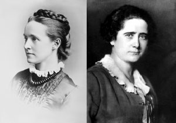
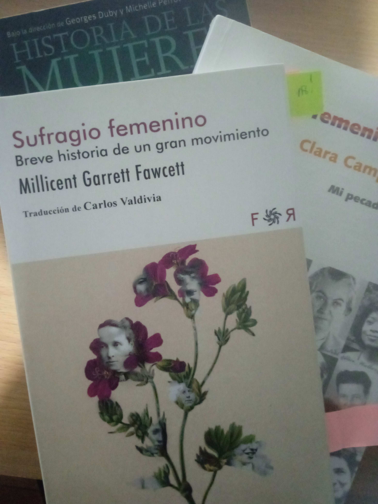
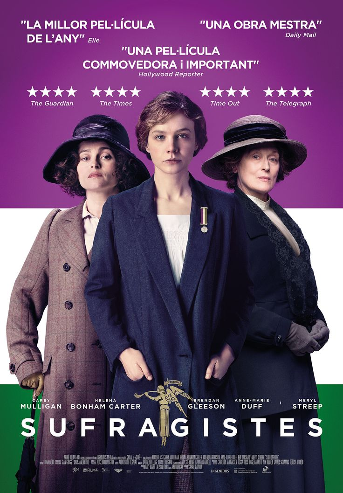

A cierta edad, al volver a estudiar Historia Contemporánea te encuentras protagonistas que en tu juventud quedaron fuera de los libros de texto. Impresiona ver hasta qué punto se ha tergiversado u ocultado el papel de la mujer. Comenta un compañero que la misma imagen de la Revolución Industrial, por ejemplo, es la de un obrero varón. ¿Acaso no trabajaban hasta los niños?, ¿quién, tras la interminable jornada laboral tenía una “segunda jornada”? Por no hablar de la iniciativa y el gran papel de las mujeres en las revoluciones o su aportación en todos los campos del conocimiento.  

*Foto: Millicent Garrett ( 1847-1929). Izq. y Clara Campoamor (1888-1972). Der.*

Recuerdo, por ejemplo, cómo aprendí el concepto de sufragio universal frente al sufragio censitario en mi niñez. Aquel “universal” sin más dejaba fuera a medio universo; se consiguió el sufragio universal y lo de la mujer vino después, como remate a la faena. 

Una vez despertado el interés por el sufragismo me decidí por la lectura de dos libros autobiográficos como forma de rescatar mujeres del silencio de historia: “El voto femenino y yo. Mi pecado mortal” de Clara Campoamor y “Sufragio femenino. Breve historia de un gran movimiento” de Millicent Garrett, menos conocido. Pese a la diferencia de casi medio siglo entre ambas sufragistas y la diferencia de años en la legalización del voto femenino en España e Inglaterra, los dos testimonios coinciden en muchos aspectos desdibujando la imagen que tenemos del sufragismo. Veamos. 

## Sufragismo, más allá del voto de la mujer 

El sufragismo se nos presenta habitualmente como una lucha con un objetivo único, una reivindicación aislada por un derecho fundamental de las mujeres y que se libró en los países occidentales. En este sentido siempre se destacan las sufragistas inglesas presididas por Emmili Pankhurst en la Inglaterra del siglo XIX o en el caso español, las diputadas Clara Campoamor y Victoria Kent en su lucha por el sufragio pasivo femenino en la España de la 2ª República. 

### Otras causas de la mujer 

Millicent Garrett en sus memorias (Garret, 2020) explica cómo, si bien las sociedades sufragistas se centraban en el voto femenino, las principales militantes consiguieron mejorar el estado legal de las mujeres con “resultados inesperados” en la década de 1830 consiguiendo la ley de propiedades de la mujer casada, la ley de custodia de menores, el derecho al acceso a estudios universitarios, la mejora de las condiciones laborales discriminatorias de la mujer o el derecho a ejercer la profesión médica.  

Merece nuestra atención la defensa de la abolición de la prostitución y el combate contra leyes denigrantes hacia las prostitutas de sufragistas como Josephine Butler.  

En la misma línea, casi un siglo después en España, podemos comprobar que el ideario de Clara Campoamor contemplaba en la década de 1930, como resume Blanca Estrella (Campoamor, 2006) además del voto femenino, la ley del divorcio, la ley del derecho del niño y la niña o la ley de investigación de paternidad. 

La misma Campoamor llevará adelante la iniciativa de un Real Decreto aboliendo la prostitución en la Segunda República y que se llegó a aprobar gracias a su empeño. 

El sufragismo, o al menos, las sufragistas más destacadas no tenían una única causa por la que luchar. 

## Cosmovisión 

Además, como una segunda objeción a una visión reduccionista del sufragismo debemos recabar que, el sufragismo inglés del XIX y el español del siglo XX, tenían una mirada sobre los problemas sociales que abarcaba más allá de su mundo, de los problemas que afectaban a las mujeres de su sociedad. De nuevo podremos establecer paralelismos cuando tomamos nota de la lucha contra el esclavismo en EEUU y el pacifismo antibelicista de aquellas sufragistas inglesas y la lucha contra la pena de muerte de Campoamor y sus propuestas a las Cortes Generales a favor del desarme declarándose “pacifista hasta la intransigencia”. 

En definitiva, el pacifismo y el abolicionismo como respuesta a toda denigración del ser humano (esclavitud o la prostitución) entran en el ideario sufragista o en su visión de la dignidad humana y modelo liberal o republicano de sociedad. 

{width=300px}

### El voto como instrumento 

A la visión sesgada del sufragismo como lucha por el voto de la mujer cabe hacer la siguiente objeción. Si bien el sufragismo reclama el derecho como principio de igualdad es, precisamente, porque lo entiende como una condición imprescindible para conseguir la igualdad en derechos privados y públicos entre hombre y mujer. No se trata de la lucha por un solo derecho sino de un empoderamiento con fin instrumental para poder avanzar hacia la plena igualdad. 

## El sufragio no vino de la noche a la mañana 

Volviendo a la lucha por el objetivo principal, el sufragio femenino, quizás este sea uno de los ejemplos más típicamente usados cuando queremos aleccionar sobre la relación causal entre “reivindicación” y “derechos”: gracias a la tenacidad en la protesta se consiguió el voto de la mujer consiguiendo torcer el brazo de parlamentos masculinos. Ni tan sencillo, ni tan simple. 

### Éxitos parciales 

El sufragismo llega a su objetivo de voto parlamentario y derecho a ser parlamentario tras un rosario de éxitos parciales. Éxitos que desde mi punto de vista pueden verse bajo dos prismas: 

Son éxitos en sí, desde el momento que suponen cambios legales o sociales que permiten a las mujeres ejercer un derecho que hasta el momento tenían vetado. Pero son éxitos, además, porqué se abre un campo de oportunidades o fortalezas para poder influir más en el poder legislativo, en los partidos políticos o en la sociedad en aras de conseguir otros objetivos más ambiciosos y el principal de todos.  

Haciendo repaso de estos éxitos tenemos, en primer lugar, el voto y participación en los consejos escolares de Inglaterra a partir de 1870 situación nueva que les permitió ampliar la base del movimiento sufragista llegando a más mujeres (y hombres).  

Un segundo logro fue poder votar en las elecciones locales, algo que acallaría la voz del antisufragismo. Respecto a este punto es interesante el testimonio de Garrett, según el cual, donde se votaba en elecciones municipales cesaban las protestas en contra del voto femenino al parlamento. Es decir que se desmontaba el argumento tremendista a medida que se normalizaba el voto femenino. 

Un tercer éxito parcial fue la participación de voluntarias en las campañas electorales de conservadores y liberales (la Prime Rose y la Federación de mujeres liberales respectivamente) a partir de la prohibición de contratar personal para campañas (Ley de Reforma 1884 y la Ley de Prácticas Corruptas 1883). Esto facilitó la influencia de la mujer sobre los partidos y, así, en 1892 se presentó (sin éxito) el primer Proyecto de Ley de Sufragio Femenino. 

Se avanzaba paso a paso. En palabras de Garrett: “las mujeres de Nueva Zelanda no se despertaron una buena mañana de 1893, como se ha dicho en ciertas ocasiones, y se vieron emancipadas”. Y es que no solo influían los logros que se iban sumando en Inglaterra (o España): hay vida tras el muro del eurocentrismo que todo lo esconde. También el derecho reconocido en otros países (incluso entidades subestatales como la Isla de Man), algunos estados de los EEUU, países del norte de Europa y especialmente en Nueva Zelanda y Australia (dentro del Imperio Británico) fueron decisivos para, al menos, romper el argumento del miedo a ese “experimento” que era como denominaban los antisufragistas al voto femenino.  

### Causas y éxitos. Las condiciones de la lucha 

Anteriormente he reseñado algunas de las causas que abrazaba el sufragismo. Fuera interesante diferenciar entre ellas, las causas más universales como el pacifismo, antibelicismo, el abolicionismo de la esclavitud, de la prostitución por una parte y, en otro apartado aquellos objetivos o idearios que afectaban de forma particular al conjunto de las mujeres en su época, sobre todo, el marco legal. 

La trifulca entre antisufragismo y sufragismo no representaba una división más en el debate parlamentario, un acalorado debate similar al concerniente al impuesto sobre los cereales. El desacuerdo era una contienda que se libraba de forma muy cruda más allá de las paredes de Westminster; en la calle, en la fábrica y también en el hogar. Un nuevo marco jurídico para la relación familiar especialmente asegurando la custodia de los hijos y el posible divorcio facilitaba, o al menos dejaba de impedir, la militancia en el sufragismo sin miedo a terribles represalias. Este es un tema que queda magníficamente retratado en la película de la directora Sarah Gavron *Suffratte* (2015), traducida como *Sufragistas*. 

{width=300px}

### Coincidencias y contradicciones 

Como una tercera consideración podríamos hablar de las coincidencias y alguna peculiaridad de los argumentos de unos y otros, sufragistas y contrarios al derecho al voto femenino en estas dos épocas y países en que vivieron Campoamor y Garrett. 

#### Calidad democrática 

La correspondencia publicada de John Stuart Mill muestra su preocupación por la injusticia que supone negar el voto a la mujer, pero también, como recuerda Millicent Garrett, su clara convicción de que era la sociedad entera la que salía perjudicada al negarse la responsabilidad de tratar asuntos nacionales. Es decir, a la razón ética o deseo de igualdad se sumaba una convicción de que, contando con toda la población, se iba a mejorar la eficacia o calidad del sistema democrático. 

Clara Campoamor, por su parte, “consideraba fatal para el resurgimiento de la libertad y la justicia que veía en la República, el divorcio espiritual entre hombres y mujeres” en lo que ella mismo aclaró como su “pensamiento político y nacional, más amplio y objetivo que el concreto feminista”. 

Por definición el sufragismo es una lucha para que todos los ciudadanos puedan ejercer los mismos derechos sin distinción de sexo, un posicionamiento sobre lo que entendemos como derechos fundamentales. Pero es aquí donde vemos coincidir a Campoamor i Stuart Mill en una definición más política que defiende una reforma para mejorar el sistema, el objetivo es la calidad de un buen gobierno, ya no conceder derechos a ciudadanos.  

#### El absurdo del antisufragismo 

Visto hoy en día, llama la atención cómo en la República Española se discutía en las Cortes Generales con mujeres parlamentarias, beneficiarias del sufragio pasivo, sobre el derecho de la mujer al sufragio activo. Cierto es que esta situación, que se nos podría antojar surrealista, como tal no se produjo en Inglaterra, pero se puede comparar a otras bien pintorescas que sí se dieron. 

Unas décadas antes, las representantes municipales londinenses integraban las mesas electorales de las elecciones al parlamento en las que no podían votar. Otro ejemplo sería el de la participación organizada por los partidos en campañas electorales: las mismas organizaciones que no las consideraban capacitadas para entender las complejas razones de la política estatal y votar, las consideraba preparadas para explicarlas a hombres estas razones y que votasen. Verdaderamente absurdo. 

#### Poca formación 

Relacionado con la supuesta “incapacidad intelectual” estaría el argumento de su falta de formación que les capacitase para discernir sobre los entresijos de la alta política, las cosas de Estado, así, en mayúscula. Aunque bien pudiera ser que se tratase de una versión más suavizada del mismo argumento; no se negaría el derecho por una incapacidad intelectual natural a su condición de mujer si no por el hecho de no disponer de estudios. Estudios negados o dificultados precisamente por su condición de mujer. O sea que más que una argumentación retorcida que esconde una trampa. No obstante, el argumento que sirvió de base para, más adelante limitar el voto femenino a mujeres mayores de 23 años y universitarias.  

En España, medio siglo después tomaba más fuerza otra razón contraria al sufragio activo femenino. Un argumento supuestamente “liberal” o “republicano” que advierte de la excesiva influencia de la tradición católica en la mujer española.  

Por contra, frente a estas premisas que, de forma generalizada, asumían una incapacidad para pensar por sí mismas a las mujeres la respuesta era común en todos los países. La capacitación para entender los entresijos de la política, así como la libertad de pensamiento no eran excusas sino, en caso de existir, problemas que había que resolver desde una óptica libera y republicana. La solución pasaba, necesariamente, por el pleno derecho al sufragio. 

## Bibliografía y otros recursos 

* Duby, Georges y Micchel Perrot. *Historia de las mujeres en Occidente. Tomo 4 y 5*. Grupo Santillana de Ediciones 1993. Madrid. 
* Campoamor, Clara. *El voto femenino y yo. Mi pecado mortal*. Unapalabraotra.org 2006
* Garrett, Millicent. *Sufragio femenino. Breve historia de un gran movimiento*. Ed Flores raras. Madrid 2019
* Gavron, Sarah (Directora) 2015. *Sufragistas*.
    
