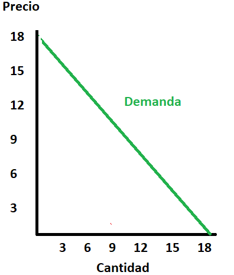
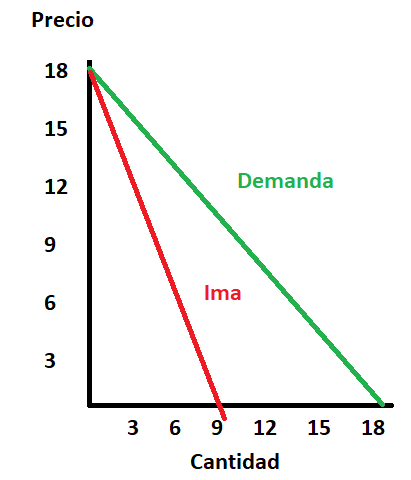
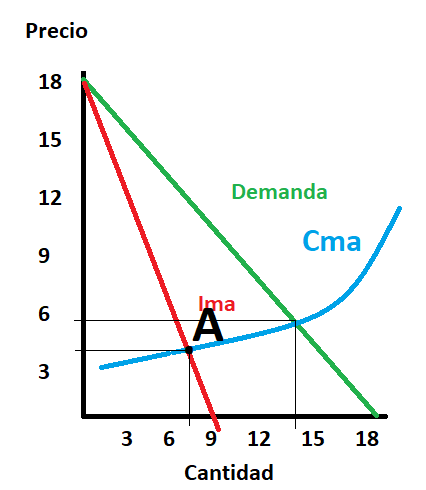

# 1. INTRODUCCIÓN

En el presente trabajo abordaremos el problema de la competencia en los
mercados y el coste social que acarrea la ausencia de ésta cuando nos
hallamos frente a monopolios.

En un primer apartado, haremos un breve repaso de algunos conceptos
básicos y estudiaremos los diferentes tipos de monopolios, para poder,
más adelante, valorar el coste social de éstos desde una perspectiva
crítica.

Nos detendremos a estudiar, en los aparatados siguientes, algunos
ejemplos que hemos elegido por su interés actual y presencia en el
debate social y político.

Uno de estos casos pertenece al ámbito de la política mundial y su
elección queda más que justificada tras la crisis del Covid-19. Se trata
del monopolio de las farmacéuticas basado en la explotación de patentes.
Veremos los argumentos a favor de estos monopolios así como las voces
críticas que han surgido a raíz de la pandemia y la preocupación por la
dependencia extrema de este sector.

Otro caso de monopolio que trataremos pertenece al ámbito de la gestión
municipal. Se trata de uno de los servicios básicos que la legislación
atribuye a las entidades locales: el abastecimiento de agua potable y
alcantarillado. El interés sobre el ciclo integral del agua arranca en
la UE a partir de la iniciativa Ciudadana Europea "Right2Water", una de
las primeras en superar el millón de firmas y conseguir el respaldo de
la Comisión Europea para reclamar como derecho lo que, hasta el momento,
era solo un negocio de concesionarias. No en balde en los últimos años
ha tomado fuerza en Europa una reivindicación ciudadana a favor de la
remunicipalización de este servicio[^1].

Otro conflicto reciente en nuestro país que afecta a un gremio o
monopolio se ha producido en las capitales de provincias y grandes
ciudades. Hablaremos de la polémica ocasionada con la entrada de nuevas
empresas como Uber o Cabify en el mercado monopolizado hasta hace poco
por el taxi.

Hemos querido reflejar también el debate sobre otro monopolio que, junto
a las patentes y concesiones administrativas, la legislación protege: el
de las actividades reguladas que quedan en manos de profesionales con
una titulación específica y colegiados. Monopolios basados en una
legislación nacional que, para unos, atiende al interés de los colegios
profesionales y que deben cuestionarse por frenar la libre
competencia[^2], mientras que, para otros, estamos ante una protección
que responde al interés general.

Lamentablemente, si existe un monopolio que en estos momentos no puede
ser obviado por alto es el de Gazprom que controla el suministro de gas
ruso en Europa. No debemos pasar la oportunidad para hacer alguna
reflexión e intentar extraer alguna lección.

En todos estos casos de monopolios se expondrán los argumentos que han
justificado o pretendido justificar su existencia así como los esgrimido
por quienes defienden la intervención de la administración para su
regulación o eliminación sin perder de vista nunca su coste social.
Evidentemente que las conclusiones que extraemos de cada ejemplo no
pretenden ser más que simples aportaciones al debate general.

Para finalizar el trabajo, intentaremos esbozar la política de la UE
frente a los monopolios actualemente más poderosos como son las grandes
tecnológicas y obtener, a partir de los hechos, una conclusión final
sobre las posibilidades reales que tenemos como ciudadanos y como país.

# 2. DEL MONOPOLIO A LA COMPETENCIA PERFECTA. 

## Cuestiones previas

En la definición de monopolio encontramos el caso extremo opuesto al de
competencia perfecta Estaremos ante un monopolio cuando no tenemos
alternativas en el mercado. Para poder hablar de monopolio deben
cumplirse tres requisitos:

-   Solo existe un productor del bien o servicio.

-   Los consumidores no disponen de bien sustitutivo.

-   Existen barreras que impiden la entrada de otras empresas en el
    mercado.

Respecto a las barreras, éstas pueden ser de tipo natural o artificial.
Las **barreras naturales** tienen que ver o bien con las economías de
escala o con mercados reducidos. En el primer caso se producen cuando
hace falta una fuerte inversión inicial para poner en marcha la
actividad empresarial destinada a proveer de un bien o servicio.
Estaremos hablando de una economía de escala.

Un ejemplo serían las concesiones administrativas en servicios a cambio
de cánones o inversiones vinculadas a la propia prestación del servicio.
En este caso, muchas de estas compañías fueron iniciativas públicas en
su origen y su actividad se basa en el suministro de energía, telefonía,
agua o la prestación de algún servicio público.

El segundo caso, el del mercado reducido, se da por razones de
rentabilidad. Cuando no hay volumen de negocio para poder convivir más
de empresas. Algo podemos ver, por ejemplo, en las concesiones
administrativas de servicios privados como bares o quioscos en espacios
o edificios públicos. En este caso es la misma Administración quien
determina el monopolio restringiendo el número de concesiones atendiendo
a un criterio realista.

Como vemos, en ambos casos es la "naturaleza" propia de la actividad y
su mercado potencial (economía de escala y mercado reducido) la que
impone el monopolio. Hablamos por ellos de monopolio natural o
inevitable.

## Las barreras de entrada. {#las-barreras-de-entrada. .unnumbered}

Cuando las **barreras de entrada son de tipo artificial** tendremos de
cuatro casos distintos de restricciones que no obedecen a causas
naturales.

El primer caso aparece cuando un recurso escaso como una materia prima
queda en manos de una sola empresa. Un segundo caso se daría cuando el
mismo Estado realiza una concesión administrativa para la prestación de
una actividad de la Administración con fines puramente recaudatorios. Un
tercer caso sería la protección legal para que los que poseedores de una
información o conocimiento nuevo puedan explotarlo durante un tiempo de
forma exclusiva y, el último caso, sería el de determinados
profesionales normalmente organizados en colegios o asociaciones.

Como vemos en este segundo bloque de tipos de monopolios no existen
razones previas o naturales ligadas a la actividad que obliguen a la
existencia de un solo proveedor. O bien es el monopolista quien ha
sabido alcanzar el pleno dominio del mercado mediante el control de un
recurso escaso, o bien es la Administración quien, según su
interpretación del interés general, o convencida por particulares ha
decidido establecer y regular el monopolio.

## Clasificación de monopolios y tipos de barrera

Veamos un cuadro resumen con la clasificación de los diferentes tipos de
barreras, monopolios y algún ejemplo.

+--------------+-------------------------------+-----------------------+
| **Tipo de    | **Tipo de monopolio**         | **Ejemplos**          |
| barreras**   |                               |                       |
+--------------+-------------------------------+-----------------------+
| Barreras     | *Economía de escala*          | Una autovía privada,  |
| naturales    |                               | una red de            |
|              | Hace falta una inversión      | distribución de       |
|              | inicial grande                | energía o agua        |
+--------------+-------------------------------+-----------------------+
|              | *Mercado reducido*            | La concesión de un    |
|              |                               | servicio de cafetería |
|              | No hay "sitio" para dos       | en un colegio         |
+--------------+-------------------------------+-----------------------+
| Barreras     | *Control de un recurso        | Propiedad de las      |
| artificiales | escaso*                       | minas de un mineral   |
|              |                               |                       |
|              | Aunque no haya razón natural  |                       |
|              | puede impedir que entren      |                       |
|              | otras empresas                |                       |
+--------------+-------------------------------+-----------------------+
|              | *Monopolio fiscal*            | Venta de tabaco en    |
|              |                               | estancos, la lotería  |
|              | Venta de bien o prestación de | o concesionarias de   |
|              | servicio exclusiva de la      | ITV privadas          |
|              | Administración a través de un |                       |
|              | tercero para obtener una      |                       |
|              | recaudación                   |                       |
+--------------+-------------------------------+-----------------------+
|              | *Basados en un patente*       | Nuevos productos      |
|              |                               | farmacéuticos         |
|              | Se permite la explotación en  |                       |
|              | exclusividad durante un       |                       |
|              | periodo                       |                       |
+--------------+-------------------------------+-----------------------+
|              | *Licencias para profesiones   | Abogados, médicos,    |
|              | liberales*                    | farmacéuticos,        |
|              |                               | arquitectos\...       |
|              | Se exige una titulación y/o   |                       |
|              | colegiarse para ejercer la    |                       |
|              | actividad profesional         |                       |
+--------------+-------------------------------+-----------------------+

## La captura del regulador

Hemos hecho un somero análisis de los diferentes monopolios atendiendo a
una causa lógica en su razón de ser. Unos nos son impuestos por las
propias limitaciones o naturaleza del mercado. Otros, son éxitos o
aciertos empresariales y, la mayoría, vienen derivados de la
preocupación del legislador por el interés general pensando en el
ciudadano consumidor y la estimulación de la inversión en innovación. No
siempre es así.

La *captura reguladora* se produce cuando el poder público pudiendo
establecer unas reglas del juego justas y equitativas que aseguren la
libre competencia hace lo contrario: dicta normas que favorecen
perversamente a una empresa o a un sector que ha tenido la capacidad de
influir y presionar para, así, conseguir riqueza y afianzarla. Estamos
ante un caso claro de *fallo del Estado.* La consecuencia es que estas
empresas, monopolistas muchas veces, obtienen beneficios que no se deben
a su mejora en competitividad, a una mayor innovación que aporte mayor
bienestar social sino a cambio de favores con un elevado coste social.

Estamos hablando, pues, de un interés particular frente al interés
general. Cuando este hecho aparece de forma constante, es la influencia
política la que marca el rumbo del mercado desplazando al genuino éxito
en el mercado capitalista.

*[El coste social]{.underline}*

Si hablamos del coste social de la *captura del regulador* debemos
entender que, a partir de este momento, los monopolios ( no
necesariamente ) implicados empiezan a destinar parte de sus beneficios
ya no a mejorar la productividad sino a la compra de favores. Debemos
hacer una mención especial merecen las famosas "puertas giratorias". Si
bien este fenómeno no lo detectaremos solo en las empresas del sector de
la energía o la banca a nivel Estatal, también se produce en otras
concesionarias de servicios municipales que ejercen su actividad como
monopolios.

Sin duda el caso paradigmático fue el de las cajas de ahorro cuyos
directivos solo reunían como requisito el perfil ideológico adecuado.
Esta ausencia de profesionales y un excesivo control político fue la
causa de una mala gestión asignado recursos en actividades sin
rendimiento y la sobreinversión en el sector del inmueble. Un coste
total que a finales del 2021 superaba los 100.000 millones de euros
entre el Fondo de Restructuración Ordenada (FROB), Fondo de Garantía de
Depósitos y el Sareb [^3]

## Hiperregulación.

Un concepto ligado al de los monopolios y el de la *captura regulatoria*
antes explicada es el de la *hiperregulación*. Según la interpretación
de algunas voces del liberalismo, el exceso de leyes, reglamentos y
procedimientos administrativos como forma de intervencionismo estatal
está fuertemente relacionado con la captura de rentas. Al contrario de
lo que pueda parecer, cuanto más complejas y grandes sean las rentas
capturables, mayor será el esfuerzo de las empresas en capturarlas. Un
esfuerzo que hemos de entenderlo en términos de coste social.

Woodron Wilson, el presidente de EEUU que a principios del siglo XX
firmó las leyes leyes antimonopolio contra el cartel de las siete
grandes petroleras: "cuando el gobierno dice a las grandes empresas lo
que deben hacer, éstas se esfuerzan para que el sector público diga lo
que ellas quieren oír".

La tendencia actual a crear normativas en forma de leyes y reglamentos
en forma excesiva ha provocado una teoría chocante: la coincidencia
entre las motivaciones de los movimientos sociales contrarios a las
grandes corporaciones con los intereses precisamente de éstas. (Jiménez,
2020).

En definitiva, la captura de rentas nace con una mala selección de
dirigentes públicos y toma forma con una regulación arbitraria,
privilegios a sectores y bloqueo sistemático a la entrada (libre
competencia) de nuevas empresas. Así se consagran a ciertos monopolios.
Las consecuencias en coste social son el capitalismo clientelar que
anula el crecimiento de la productividad así como la innovación
empresarial que es lo que traería un capitalismo competitivo.

**Consideraciones**

*Casos extremos*

Entre el monopolio y la competencia perfecta, que serían los dos casos
extremos en que podría hallarse un mercado desde el punto de vista de la
libertad de opciones para el consumidor, tenemos una infinidad de
posibilidades contemplando, entre estas los oligopolios.

*Oligopolios y monopolios*

Si con el término oligopolio nos referimos a un conjunto reducido de las
empresas que pueden competir por una concesión administrativa en un
ámbito, por ejemplo, una vez conseguida la concesión, nos referirnos a
la empresa ganadora como monopolista. Este sería el caso de las grandes
empresas que optan a las privatizaciones del servicio de abastecimiento
de agua potable en una gran ciudad, por ejemplo.

*Combinación de barreras*

La existencia de una barrera suficientemente alta para definir un
monopolio, no significa que no pueda coexistir con otras barreras.
Imaginemos por ejemplo una comunidad de regantes titular de la concesión
administrativa para el suministro de agua de riego en un área concreta y
la propiedad de todos los pozos existentes. ¿Estaríamos hablando de una
barrera natural o artificial? La concesión por parte de la Confederación
Hidrográfica sería de carácter artificial legal. La inversión realizada
para la construcción de pozo y canalizaciones requiere de una economía
de escala y, por tanto, sería una barrera natural. Si, además, no hay
posibilidad de obtener agua de otros manantiales o del subsuelo,
tendríamos una tercera barrera artificial por el control de un recurso
escaso.

Cualquier propietario que buscase una alternativa al monopolio debería
superar las dos primeras: concesión administrativa e inversión en una
pequeña perforación además del acierto de un zahorí para la tercera.

## El debate sobre la reversión {#el-debate-sobre-la-reversión .unnumbered}

Si la modificación de impuestos, la legislación o el control de precios
como formas de regulación de los monopolios puede ser objeto de debate
político no lo es menos la reversión de un servicio privatizado.

Veamos el ejemplo de las Inspecciones Técnicas de Vehículos que
empezaron siendo un servicio público de las Comunidades Autonómicas y en
su mayoría se privatizaron.

En 2023, el monopolio [^4] de la ITV, dejará de existir como tal en la
Comunidad Valenciana y volverá a ser un servició público (como se hizo
ya anteriormente con algunos hospitales de gestión privada) gestionado
por una sociedad pública de la Generalitat, la Sociedad Valenciana de
Inspección Técnica de Vehículos. El principal argumento en defensa de
esta reversión es la reducción del coste para el usuario final. Además,
el Consell prevé unos ingresos netos de casi 8,5 millones de euros
anuales[^5]. Esto nos puede dar una idea del coste social del monopolio
actual.

Al margen de poder objetar si la reversión para abaratar el uso del
automóvil es una idea acertada o el optimismo de las cifras
presupuestadas, hay un argumento interesante en contra de esta decisión
y que, de hecho, lo esgrime la Asociación de Entidades Concesionarias de
la Comunidad Valenciana para la Inspección Técnica de Vehículos
(AECOVA-ITV): la Comunidad Valenciana es una de las autonomías con menos
quejas[^6]: la eficacia atendiendo rápidamente y en un horario flexible.

Contrariamente, en Andalucía que se mantiene el servicio público sin
haberse privatizado nunca, el debate está abierto y se defiende el
modelo de monopolio privado justamente por entender que sería la
solución para mejorar la calidad del servicio para los usuarios finales.

## Debate sobre la regulación {#debate-sobre-la-regulación .unnumbered}

¿Por qué en determinadas medidas antimonopolio existe una práctica
unanimidad, como veremos con la nueva Ley de Mercado Digital europea y
en otros casos no?

La respuesta quizás sea el coste social cea el factor determinante más
que una decisión "técnica". Desde un punto de vista material, que un
monopolio controle la ITV en una comarca no tiene el mismo coste social
que si controla todo el suministro de gas ruso hacia Europa.

Pero el coste social debe entenderse como algo solamente material. Los
derechos digitales serían un buen ejemplo. Votar en un parlamento
autonómico para que los ciudadanos paguen unos euros más por la ITV es
asumible políticamente por que lo es socialmente, votar en un parlamento
europeo para permitir un uso libre de WhatshApp y Facebook de los datos
personales no es asumible socialmente.

## Conclusiones {#conclusiones .unnumbered}

Pese a la unanimidad respecto al peligro que representan los monopolios
para el consumidor o ciudadano y las ventajas que aporta la libre
competencia, no siempre existe una unanimidad a la hora de analizar el
problema y, sobre todo, de acordar soluciones.

Es el coste social pero no solamente medido en términos económicos lo
que predispone al legislador a proponer medidas antimonopolio.

##   {#section .unnumbered}

# 3. ACTIVIDADES REGULADAS.

Como ya sabemos, el concepto de monopolio no debemos relacionarlo, al
menos de forma exclusiva, con las principales corporaciones
tecnológicas, las empresas del IBEX35 o grandes industrias dominantes de
un sector determinado.

Existen sectores absolutamente controlados por profesionales que,
mediante alguna forma de asociacionismo (colegios profesionales,
asociaciones profesionales...) que actúan como grupo de interés y
consiguen disfrutar de la protección legal para poder ejercer su
actividad profesional sin la entrada de otras profesiones o
profesionales que pudiesen ofrecer un servicio sustitutivo: farmacias,
notarias, estancos, taxistas, autoescuelas o colegios profesionales.

## Los colegios profesionales {#los-colegios-profesionales .unnumbered}

Es evidente que hay actividades en las cuales, en aras de proteger a la
ciudadanía, habrá que evitar el intrusismo profesional o la llamada
competencia desleal pero no faltan voces que consideran que se ha
pervertido el sentido de esta regulación llegando a una sobreprotección
que perjudica al conjunto de la sociedad. Es decir que estos monopolios,
como tales, nos suponen un coste social alto.

A modo de anécdota podríamos exponer el caso de un falso dentista de
caballos que fue multado en Valencia por intrusismo laboral al ser
denunciado por el colegio de veterinarios.

## El debate sobre el monopolio {#el-debate-sobre-el-monopolio .unnumbered}

Entre los argumentos defendidos por los contrarios a la existencia o
carácter obligatorio de los colegios profesionales podríamos citar

-   Las cuotas que limitan o condicionan la entrada y actúan como
    barrera de entrada al mercado de nuevos profesionales.

```{=html}
<!-- -->
```
-   La supuesta defensa parcial del sector. Especialmente el de
    farmacéuticos al que se le acusa de atender solo a los intereses de
    los propietarios de farmacias.

-   La obligación de los visados de proyectos al entender que la
    titulación ya avala el proyecto y la administración es responsable
    al tramitarse las licencias oportunas.

Por su contra, la defensa de los colegios argumenta que gracias a la
colegiación y los visados se consigue:

-   Evitar el intrusismo profesional.

-   Asegurar la titulación real de los proyectistas.

-   Dar unas orientaciones en cuanto a honorarios que eviten los abusos.

*¿Freno a la competitividad e innovación?*

Las críticas al proteccionismo de los profesionales o determinadas
actividades provienen también de pensadores liberales que ven en estas
medidas un exceso de intervencionismo (estatismo) tanto por parte de la
derecha como de la izquierda y que suponen un freno a la innovación, la
competitividad al frenar la entrada de inmigrantes y dificultar el
ascenso social (McCloskey, 2020).

Pero la verdad es que el coste social que algunos de estos monopolios
organizados en grupos de interés e influyentes provocan es alto. La
presión de las autoescuelas por impedir el sistema de clases on-line es
un claro ejemplo de barrera a la innovación y la libre competencia o la
limitación del número de farmacias por habitante. Ejemplos de monopolios
basados en la legislación que afectan negativamente en el bienestar
general.

## Conclusión {#conclusión .unnumbered}

Pese a que 2014 se redujo el número de colegios oficiales obligatorios
de 80 a 35, la Comisión Europea sigue considerando la colegiación
obligatoria contraria a la libre competencia.

Con todo, los ministros y gobiernos de diferente signo han evitado
abordar esta cuestión precisamente por miedo a la reacción de los
propios colegios. Aparentemente nos encontramos ante un círculo vicioso:
la causa por la que no se intenta resolver el problema es una parte del
problema. Lo expuesto para colegios profesionales no dista mucho de los
que ocurre con otras asociaciones profesionales como vemos en el caso de
las autoescuelas.

#   {#section-1 .unnumbered}

# 4. EL TRANSPORTE COMO SERVICIO.

Uno de los debates recientes más importantes relacionados con el
monopolio basado en licencias es el ocasionado a partir de la entrada de
Uber o Cabify como competidores directos de lo que era el monopolio del
taxi en nuestras ciudades.

Si algo podemos afirmar es que tenemos una respuesta desigual entre la
clase política y la sociedad. Mientras el ciudadano (consumidor) percibe
de forma, más bien positiva, la entrada al mercado de estas compañías
como un servicio más (sustitutivo al del taxi), algunos gobiernos
municipales han reaccionado con medidas proteccionistas en favor del
taxi y, casi disuasorias, contra la implantación de un nuevo servicio en
su ciudad.

Desde la perspectiva del interés general entendida como una mayor oferta
de servicios y la mejora que aporta la competencia, la regulación
proteccionista del taxi tiene un elevado coste social. Sin duda que para
los ciudadanos y empresas de una ciudad existe una diferencia de
bienestar entre disponer sólo de taxis o, además, poder contar con el
servicio de Uber o Cabify compitiendo libremente.

## Uber y Cabify. El ejemplo de València.

Dejamos constancia de dos datos objetivos que revelan el coste social o
pérdida que implicaría continuar con el monopolio del taxi en ciudades
como València.

La prensa valenciana realizó algunos estudios comparativos entre los
diferentes servicios de Cabify, Uber y el taxi para el mismo trayecto
dentro de la ciudad de València en 2019. Si bien la diferencia del
importe era poco importante, había dos diferencias que motivaron más de
un comentario por parte de los lectores. La primera consistía en
disponer de un precio fijo antes de empezar el servicio por parte de las
nuevas empresas mientras que, en el uso del taxi, el importe final
dependía del tráfico o las retenciones; de hecho, en el estudio se
tuvieron que repetir los viajes en taxi.

El segundo hecho más destacable ya al margen del pequeño estudio de la
prensa, se dio en las comodidades en formas de pago y de contratación en
si de los taxis. El sector paso de limitarse a tener las zonas urbanas
repartidas y sus turnos establecidos, a disponer de *app* e incluso la
implantación generalizada de datáfonos que tantas veces habías reclamado
los clientes sin éxito.

## Conclusiones. {#conclusiones. .unnumbered}

[El incentivo.]{.underline}

La noticia de la inminente llegada de Uber o Cabify actuó por fin como
"incentivo" para adaptarse a las innovaciones propias de la época y,
casi con una década de retraso. Un claro ejemplo de cómo los monopolios
acomodan al monopolista y frenan la inversión mientras que la
competencia libre causa el efecto contrario beneficiando a la sociedad.

[Desde arriba, si se puede.]{.underline}

Hasta el momento hemos visto ejemplos de monopolio donde la presión por
la liberalización se ejerce desde la base social o como recomendación
europea sin lograr la acción legislativa requerida. En este ejemplo,
contrariamente, los ministros y grupos parlamentarios no han podido
hacer oídos sordos a nadie. La firma del Tratado Transatlántico de Libre
Comercio e Inversión (TTIP) entre la UE y EEUU suprimían las barreras
legales de España y permitían la entrada de Uber y Cabify.

1.  Curiosa paradoja. Podríamos pensar que el interés de grandes
    compañías defensoras del tratado ha sido la clave para acabar con el
    monopolio del taxi. Compañías a las que, por cierto, habrá que
    vigilar para evitar prácticas de colusión o concentraciones.

# 5. EL CICLO INTEGRAL DEL AGUA. ¿NEGOCIO O DERECHO?

Veamos ahora un servicio público con una casuística bastante variada e
interesante que nos permite estudiar el origen y los problemas de
control de los monopolios. Partimos de la creación inicial del monopolio
a partir de empresas públicas, pasamos por las relaciones con los
partidos políticos del poder para acabar en una privatización (parcial o
total) posterior y, finalmente, las constantes batallas judiciales
planteadas por otras empresas que intentan entrar en el mercado.

## Privatización y economía de escala

El servicio de abastecimiento de agua potable tiene unos costes fijos
muy elevados debido a la propia característica de servicio en red. Esto
crea un problema de rentabilidad en los municipios de menor tamaño
poblacional donde el número de altas (usuarios finales domésticos o
industriales) es menor. La falta de mercado, de consumidores, impide una
economía de escala. Esta es una de las razones por las que se dan dos
tipos de agrupaciones supramunicipales: las Mancomunidades de municipios
y los consorcios municipales.

*Servicio de gestión pública*

En el caso de que sea el Ayuntamiento quien lleve directamente la
gestión del agua, la tasa no responde a la lógica de un importe por m³
mucho más caro en la zona rural de España que en las áreas urbanas que
cabría esperar. La razón es de índole político. La mayoría de las
alcaldías son reacias a la actualización de las tarifas. En los casos de
gestión pública, escasos en la Comunidad Valenciana, los plenos
municipales prefieren mantener las tasas públicas "populares". Crean,
así, un servicio deficitario cuyas pérdidas serán asumidas vía impuestos
municipales. Es decir, los usuarios no pagan lo que deberían por el agua
potable a través de la tasa, pero sí en el IBI.

*Las razones de la privatización*

La principal razón de la privatización de la gestión del agua potable es
la dificultad para dar respuesta técnica al mantenimiento de la red,
asegurando un servicio sin largas interrupciones y con absoluto control
sanitario. Cuestión aparte es si en el pliego de condiciones
administrativa se exige un canon inicial con el que el gobierno
municipal pretenda sanear las cuentas municipales.

*Monopolio privado. La regulación por control de precios*

En los casos de gestión privada, podemos encontrarnos en diferentes
escenarios.

El primer escenario aparece cuando el Ayuntamiento rechaza la
actualización de precios propuesta por el monopolista. Aquí, antes de
llegar a una resolución del conflicto vía contencioso-administrativo, en
la Comunidad Valenciana, puede que el Ayuntamiento acepte la revisión
ante el dictamen de la Comisión reguladora de precios de la Conselleria
d'Economia, órgano de arbitraje al que recurren las empresas.

El segundo escenario es el que aparece de forma habitual cuando ya han
pasado años desde la privatización. Con la rotación en el gobierno
acaben, gobierno y oposición, apartan este tema del debate y asumen que
la empresa no puede tener pérdidas ni el ayuntamiento permitirse más
contenciosos aceptando las revisiones de precio debidamente
justificadas.

A la situación de monopolio, es decir la ausencia de competidor,
producto sustitutivo e imposibilidad de dos empresas suministradoras se
une el hecho de que las concesiones administrativas para la explotación
del servicio municipal suelen durar varios años incluso décadas. Sin
duda estos factores no son precisamente los que animan o incentivas a
una empresa a mejorar su organización, innovar o invertir sus costes.

*Origen público del monopolio*

En los manuales de economía suele hacerse mención de los monopolios
surgidos del propio sector público normalmente vinculados a los
servicios básicos como la energía. Nos referimos a empresas públicas
privatizadas posteriormente para competir en supuesta igualdad de
condiciones en un mercado liberalizado. En el caso del agua potable en
las provincias valencianas también ocurrió lo mismo con empresas de las
Diputaciones provinciales pero sin llegar a privatizarse del todo.

EGEVASA, empresa creada por la Diputación de Valencia en 1988 llegó a
funcionar como un monopolio hasta apenas hace unos años con la entrada
en el mercado por parte de otras grandes empresas. La polémica ha
continuado debido a que hoy esta empresa continúa con el 51% de sus
acciones en manos de la Diputación y un sinfín de pleitos en
adjudicaciones tanto de servicios como de obras.

## Ejemplo de maximización de beneficios {#ejemplo-de-maximización-de-beneficios .unnumbered}

Para el control de precios del agua potable en los monopolios, en la
Comunidad Valenciana, un Decreto autonómico[^7] regula el proceso de
revisión de tarifas de agua potable a partir de los costes y establece
un organismo de arbitraje (Comisión de Precios).

El Decreto aprobado en 2013 incorporó dos novedades. Por una parte, se
modificaba la fórmula polinómica para la actualización de los precios
incluyendo un "coeficiente corrector de retracción del consumo" mediante
el cual, ante cualquier reducción de consumo anual respecto al año
anterior, la empresa podía solicitar un aumento de la tarifa, asegurando
así que el Excedente del Productor que como monopolistas disfrutaban no
sufriese ninguna reducción: al reducirse la cantidad de venta,
aumentaban el precio.

La bajada en el consumo en el año *n-1*, causaba una disminución de
Ingresos Totales que se podría empezar a recuperar en el mismo año *n*
si la administración era "diligente" en atender la solicitud de
revisión. Figura 1.

**La teoría de la maximización de beneficios.**

La Curva de demanda del monopolio es la curva de la
demanda del mercado. De manera que un aumento del precio
desincentiva la compra. 

*Figura 1*
{width='300px'}

Vemos como el ingreso marginal para el monopolista es
inferior al precio (por debajo de la curva de demanda).
Figura 2.
*Figura 2*
{width='300px'}

|Cantidad |Precio| Total| *Ima*|
|:--|:--|:--|:--|
|6| 12| 72 |-|
|7| 11| 77| 5|
|8 |10 |80 |3|
|9| 9| 81| 1|

Si ponemos en relación el ingreso marginal (Figura
3) con el Coste Marginal, observamos dos
efectos:

* *Efecto cantidad*: un aumento de la cantidad produce un aumento de
    ingresos.
* *Efecto precio*: un aumento de cantidad reduce el precio y por lo
    tanto el ingreso.

*Figura 3*  
{width='300px'}


Hasta el punto en que Cantidad = 9, el efecto cantidad supera al efecto
precio. O sea que el Ima es mayor que el Cma. A partir de una Cantidad
\>9 el efecto precio es mayor por lo que Ima pasa a ser negativo.

En un mercado de competencia perfecta el
punto objetivo sería situarnos en una producción tal que Cma=Ima
representada en la *Figura3* como el punto A.

Pero en un monopolio, el monopolista buscará la ***maximización de
beneficios,*** por lo que intentará subir el precio hasta llegar al
límite que estén dispuestos a pagar los consumidores. En la gráfica
quería representado con el paso de A a B como vemos en la *Figura 4*.

*Figura 4*
{width='300px'}

Este cambio de precio en un mercado regulado precisa de una normativa,
un procedimiento y una autoridad que le permita elevar el precio por
encima de P1. La modificación de la fórmula de revisión de precios del
Decreto autonómico del 2013 con la novedad del *coeficiente corrector
por retracción de consumo* lo dejaba todo atado.

Por cierto, el otro cambio significante que introducía el Decreto
valenciano era el aumento del número de vocales de la Comisión de
Precios en representación de las pocas, pero importantes concesionarias
que operan en la autonomía. Algo que nos permite ya abundar en la teoría
de la **captura reguladora**.

## Control de precios: entre el desequilibrio económico y enriquecimiento injusto.

Las solicitudes de revisión de precios no son más que peticiones
justificadas de corregir el **desequilibrio económico** que afecta al
monopolista como concesionario siempre que las causas alegadas por la
concesionaria estén previstas en la legislación o jurisprudencia.

La aplicación incorrecta de este principio, en un sentido u otro, podría
suponer un **enriquecimiento injusto** y no ha habido pocos casos en
nuestra autonomía.

En el caso de asociaciones público-privadas donde la parte privada
invierte en la construcción o mejora de alguna infraestructura a cambio
de su explotación por un periodo determinado Joseph E. Stigliz opina que
"A menudo estas asociaciones consisten en que el gobierno asuma los
riesgos de las pérdidas y el sector privado se quede con las ganancias"
(Stiglitz, 2020).

## Conclusión {#conclusión-1 .unnumbered}

Si en al principio de este apartado comentábamos cómo, tras la
privatización de la gestión del servicio de agua potable y
alcantarillado acababan unos problemas técnicos para los Ayuntamientos,
ahora podemos afirmar que empezaban otros con el monopolio.

En la regulación mediante control de precios, la justificación de las
revisiones de tarifas, pueden convertirse en un problema para los
pequeños municipios sin técnicos especialistas en plantilla y con una
Secretaría-intervención compartida. No olvidemos que la Comisión de
Precios autonómica se limitará a revisar la aplicación correcta de la
fórmula y la observación del procedimiento sin entrar en el detalle de
la existencia y adecuación detallada de los costes imputados. A esto
podría añadirse, las incertidumbres que dejan los pliegos de cláusulas
administrativas o contratos como son la delimitación de
responsabilidades o aclarar el límite entre una reparación, reformas o
mejoras.


# 6. LAS PATENTES Y LAS FARMACÉUTICAS.

El mecanismo de patentes supone una barrera artificial de tipo
legislativo como hemos indicado en el primer apartado que ha disfrutado
de bastante aceptación social por norma general excepto en lo
concerniente a fármacos cuando se trataba, sobre todo, de salvar vidas.

El argumentario que podemos encontrar en los libros de texto a favor de
esta fórmula de proteccionismo de los grandes laboratorios era que
respondía al interés general en última instancia. A saber, asegura a las
empresas que invierten en investigación que van a poder usar su patente
de forma exclusiva durante un periodo mínimo de tiempo era una condición
necesaria para que las empresas estuviesen incentivadas permanentemente
en invertir en investigación. De alguna forma se podía entender como una
extensión el concepto de derecho a la propiedad privada que el
liberalismo consagra el liberalismo y encomienda su protección al
Estado.

Quizás de todos los tipos de monopolio asegurado por las leyes, este
junto al del desempeño de algunas profesiones sea el que menos rechazo
social pudiese provocar al explicarse su razón de ser y la caducidad de
las patentes a partir de la cual desaparece el monopolio, el
conocimiento queda al alcance de cualquier empresa y el coste social del
producto empieza a bajar.

## El efecto del Covid19

Durante la pandemia del Covid19 la desesperación por encontrar una
vacuna que, además en poco tiempo pudiese ser testeada, se sumaban un
sin fin de incertidumbres sobre cómo hacerla llegar a la población
mundial: la posibilidad de compra por parte del Estado, la coordinación
o no con el resto de Europa, la forma de distribución y, sobre todo, esa
horrible duda sobre qué criterios de prioridad establecer respecto a
tramos distintos de población.

En este contexto surge la duda sobre el papel interesado de las
farmacéuticas y aparecen publicaciones sobre el retorno social de todas
las ayudas públicas recibidas por las farmacéuticas durante décadas y la
falta de condicionamiento de éstas.

Es decir, nos encontramos ante una revisión crítica con lo ya estudiado
en los anteriores temas de la asignatura: el papel del Estado. Un papel
ausente al haberse limitado a la consigna liberal de proteger la
propiedad, en este caso intelectual mediante las patentes.

## Sobre la subvención pública. {#sobre-la-subvención-pública. .unnumbered}

La opinión general es que sin duda el conjunto de la sociedad se
beneficia del resultado y aplicación de las investigaciones. Sin los
avances tecnológicos conseguidos en los laboratorios de empresas
privadas no dispondríamos de toda la comodidad que caracteriza o define
nuestro bienestar actual. Llegado a este punto la pregunta es si la
investigación privada debe ser subvencionada. Joseph E. Stiglitz
entiende que "Todos nos beneficiamos de innovaciones como los
transistores o láseres. Esta es la razón por la que la investigación
básica debe ser financiada por el Gobierno".

Mazzucato, a raíz de la reciente pandemia, denuncia precisamente que el
gobierno de EEUU "concede la exclusividad a las empresas farmacéuticas
para que lleven a cabo las últimas fases del desarrollo de medicamentos
basadas en invenciones financiadas con dinero público. Y lo hace sin
exigir que esos medicamentos sean asequibles o accesibles en general.
Estas licencias exclusivas permiten a las compañías farmacéuticas
disfrutar de un monopolio y cobrar precios exorbitantes por tecnologías
médicas desarrolladas con fondos públicos".

Además, la economista italo-americana, advierte que la tendencia de hace
años de las grandes farmacéuticas no es invertir en investigación sino
adquirir pequeñas empresas de biotecnología dependientes de ayudas
públicas (Mazzucato, 2022).

## Conclusión {#conclusión-2 .unnumbered}

Los precios elevados de los medicamentos obtenidos de forma indirecta
gracias a los recursos públicos son una perversión del sistema con un
coste social intolerable. La causa es la falta de condicionantes en la
asociación público-privada. No podemos descartar la influencia de las
farmacéuticas en los gobiernos: la captura del legislador[^8]


# 7. GAZPROM (RUSIA)

## La fuerza del monopolio {#la-fuerza-del-monopolio .unnumbered}

Fundada en 1989 por el Ministerio Soviético de la Industria del Gas, es
la corporación más grande de Rusia pero fue con el gobierno de Putin
cuando alcanzó la relevancia actual al pasar a tener éste un control
absoluto sobre ella.

Mientras Europa tardará años en encontrar su producto sustitutivo, Rusia
o Gazprom, ya hizo los deberes en 2019 al concluir el gasoducto que les
abre el mercado chino, Power of Siberia, es decir consiguió un mercado
alternativo.

## Cantidad, precio... moneda y forma de pago {#cantidad-precio-moneda-y-forma-de-pago .unnumbered}

Una de las características del monopolio, es que tras decidir la
cantidad de producto a vender o verse esta reducida puede aumentar el
precio por encima de su coste marginal[^9]. Efectivamente Rusia ha
podido reducir el suministro de gas a Europa a través del gasoducto Nord
Stream o interrumpirlo unilateralmente[^10], imponer nuevos precios y
exigir (contra las medidas de sanción impuestas) el rublo como moneda de
pago mediante un mecanismo [^11] que fuerza al cliente a abrir dos
cuentas en Gazprombank. Una en rublos y otra en la moneda estipulada en
el contrato, el banco convertirá a rublos en el mercado de divisas de
Moscú lo pagado por el cliente y lo depositará en la cuenta de rublos.
Se "elude" así las restricciones impuestas.

## Conclusión {#conclusión-3 .unnumbered}

La dependencia de Europa respecto al gas ruso es una cuestión tan
indiscutible hoy en día como trágica. Gazprom es el monopolio que
demuestra claramente el peligro que suponen los monopolios hasta para el
más feliz de los incrédulos al haberse convertido en el instrumento o
arma para los objetivos, no solo comerciales, sino también geopolíticos
de un régimen iliberal. El coste social del gas ruso va más allá de las
nuevas condiciones de venta impuestas abusando de su posición de
monopolista creando un clima de incertidumbre en la economía europea y
alarma social.

# 8. LA INTERVENCIÓN PÚBLICA FRENTE A LOS MONOPOLIOS.

## De las formas de regulación {#de-las-formas-de-regulación .unnumbered}

En este tema hemos estudiado los tres tipos de regulación (legislación,
control de precios y establecimiento de impuestos) como soluciones entre
un intervencionismo más radical que supone la estatalización o
nacionalización de una actividad o la reversión de un servicio
privatizado o, en el otro extremo, la solución que nos recuerda al
*laissez-faire* de la **teoría de los mercados disputables** según la
cual, el monopolista no se confía nunca y ante la posibilidad de la
entrada de un competidor que mejora su oferta.

En los diferentes ejemplos de monopolios expuestos en este trabajo,
hemos expuesto las formas de regulación que predominan hoy en día.

Cuando hemos abordado el tema del servicio de agua potable, hemos
tratado la problemática del control de precios, asís como la nueva
tendencia en Europa a la reversión del servicio. Una decisión soberana
que toman algunos gobiernos municipales similar a la tomada por el
gobierno autonómico valenciano en las ITV.

En otros casos, cuando el monopolio no tiene justificación legal según
el criterio mayoritario del legislativo, éste es quien aprueba leyes o
autoriza la firma de tratados (normas con fuerza de ley) contra los
monopolios. Éstas, prevén desde la desmantelación mediante la
fragmentación en dos o más empresas, la obligación de vender parte de
sus acciones o la exigencia de autorización previa en caso de
concentraciones, fusiones o adquisiciones de empresas por parte de
organismos como la Comisión Nacional de Mercados y la Competencia en
España [^12]. Como ejemplo más conocido tendríamos el caso del monopolio
del taxi tras el TTIP.

La vía de la legislación es la escogida en el seno de la Comisión
Europea y el parlamento europeo vetando todo tipo de prácticas
colusorias que pueden darse entre oligopolios y que vulneran el
principio de libre competencia. En este sentido debemos remitirnos para
cualquier consulta al Tratado de Funcionamiento de la UE[^13] o la misma
legislación española además de la Ley 15/2007[^14] y consultar las
muchas resoluciones públicas de la CNMC.

Como resume el documento explicativo de la Comisión Europea sobre
"Competencia "a través del control de las concentraciones, los
monopolios y las ayudas estatales, la Comisión garantiza una competencia
sin distorsión en el mercado interior. Este entorno equitativo garantiza
a todas las empresas europeas, incluidas las pequeñas y medianas
empresas\
(PYME), el acceso al gran y sofisticado mercado interior de la UE"

## Nueva legislación europea.

En esta línea, este mismo año Bruselas ha aprobado la una nueva norma
antimonopolio[^15], la Ley de Mercado Digitales que, en palabras del
eurodiputado ponente Andreas Schwab "acaba con el dominio cada vez mayor
de las grandes empresas tecnológicas". Esta ley pretende ser una
garantía de los derechos digitales de la ciudadanía en la UE imponiendo
restricciones a las corporaciones que superen los 75.000 millones de
euros de valor de mercado: las conocidas con el acrónimo de GAFAM
(Google, Amazon, Facebook, Apple o Microsoft). A partir de ahora, estos
gigantes del mercado deberán garantizar:

-   Libertad de poder escoger qué tienda de *app* en el dispositivo.

-   Libertad de decidir sobre la publicidad a recibir.

-   Privacidad al prohibir el cruce de datos personales entre *app* (el
    ejemplo de Whatshap y Facebook)

"Las grandes empresas tecnológicas deben demostrar que también permiten
una competencia leal en Internet", en palabras del Schwab. Una amplísima
mayoría del parlamento europeo tuvo claro que había que frenar a las
grandes compañías tecnológicas (Google, Amazon, Apple o Meta).
Consecuentemente se espera en el 2023 entre en vigor en España la nueva
ley de competencia.

## Actuaciones recientes de la Comisión europea {#actuaciones-recientes-de-la-comisión-europea .unnumbered}

Un ejemplo de acción de la Comisión Europea en su función de ejecutivo,
lo tuvimos el pasado mes de octubre cuando inició una investigación en
la empresa Delivery Hero y su filial española Glovo para determinar si
había incurrido en prácticas tendentes a la creación de cárteres.

## Conclusión {#conclusión-4 .unnumbered}

A partir del Tratado de Funcionamiento de la UE, de las nuevas leyes
comunitarias y nacionales, así como las actuaciones europeas y acuerdos
comerciales, podemos deducir que la vía de la regulación de los
monopolios mediante la legislación es la que va a tener una mayor
aceptación, quizás porqué es la que refleja las preferencias del
*votante mediano.*

# 9. CONCLUSIÓN FINAL {#conclusión-final .unnumbered}

En el anterior trabajo referente al papel económico del Estado vimos
como Piketty proponía que la solución a la competencia fiscal, la
redistribución de renta y el mantenimiento del Estado del Bienestar
debería ser una solución que superase el marco nacional y fuese mundial.

En este trabajo, a la hora de plantear la necesidad de frenar o regular
a los monopolios o, de manera más genérica, alcanzar la mayor cuota de
competencia libre desde la acción conjunta de los Estados, concluiremos
que debe la solución pasa, también por un marco supranacional que
legisle. Aunque, a diferencia del tema anterior, ya no estamos abordando
propuestas teóricas un tanto utópicas sino extrayendo conclusiones de
los hechos recientes y actuales. Citemos para acabar ya los más
importantes.

La búsqueda y suministro de alguna vacuna frente a la pandemia del
Covid-19 evidenció que, pese a las dudas y desencuentros iniciales
lógicos, la cooperación europea, fue necesaria para negociar con las
grandes farmacéuticas con sus patentes como sigue siendo ahora para la
recuperación.

La crisis actual frente al monopolio del gas ruso también es un
argumento a favor de la acción conjunta y coordinada en el seno de la UE
frente al monopolio ruso.

Y ya acabando, una pregunta ¿hay alguien capaz de imaginar, si quiera,
la posibilidad de que un Estado europeo cualquiera pudiese, en
solitario, imponer alguna restricción a Whatshap o Facebook? Juntos, en
cambio, si se puede.

Frete a los monopolios hacen falta instrumentos, como mínimo,
equiparables en fuerza y dimensión. Éstos, hoy en día, ya no pueden ser
los Estados sino la su unión política y económica. Fuera de Europa, la
batalla frente al abuso de los monopolios, no llegaría ni a librarse.

# 10. BIBLIOGRAFÍA

* Martí X. 2020. "La resposta liberal". Barcelona. Editorial Base
* Mazzucato, Mariana 2021, "No desaprovechemos esta crisis". Madrid.
    Galaxia Gutenberg.
* McCloskey, Deirdre 2021, "¿Por qué el liberalismo funciona?".
    Madrid. Deusto.
* Miguel Á. García Rubio et alt. 2020. "Informe sobre el ciclo
    integral del agua en pequeños y medianos municipios". Departamento
    de Economía Aplicada, Universidad de Granada.
* Stiglitz, Joseph E. 2020, "El capitalismo progresista". Madrid.
    Penguin Random House Grupo Editorial.

* Perdigó, Joan, 2021 "La municipalización del servicio de
    abastecimiento de agua en la actualidad" INAP
    <https://laadministracionaldia.inap.es/noticia.asp?id=1510307>
* Wonnacott, Paul y Wonnacott, Ronald, 1991. "Economía". México.
    McGraw-Hill


[^1]: https://www.eldiario.es/economia/organizarse-luchar-privatizacion-agua_1_2811558.html

[^2]: https://confilegal.com/20180205-la-cnmc-recuerda-al-gobierno-que-esta-pendiente-la-reforma-de-la-ley-de-servicios-y-colegios-profesionales/

[^3]: https://www.eleconomista.es/empresas-finanzas/noticias/11520847/12/21/El-coste-para-el-Estado-del-rescate-bancario-se-eleva-a-101500-millones.html

[^4]:Si bien un usuario tiene la posibilidad de pasar la ITV en cualquier estación por lo que no podríamos hablar de monopolio en un sentido estricto, lo lógico y más cómodo es hacerlo en el área de residencia. Además para determinados vehículos como los agrícolas es impensable desplazarse. Asumimos pues que la barrera de entrada es suficientemente alta como para poder hablar de monopolio.

[^5]: https://www.informacion.es/politica/2022/11/04/consell-preve-beneficios-reversion-itv-78147465.html

[^6]:https://www.informacion.es%2Feconomia%2F2022%2F08%2F23%2Fitv-piden-prorroga-ano-consell-73792355.html

[^7]:DECRETO 68/2013, de 7 de junio, del Consell, por el que se regula
    la Comisión de Precios de la Generalitat y los procedimientos para
    la implantación o modificación de precios o tarifas sujetos al
    régimen de autorización y comunicación.

[^8]:https://www.eldiario.es/sociedad/maniobra-bruselas-lobby-grandes-farmaceuticas-conservar-patentes-vacunas-tratamientos-covid-19_1_7833862.html

[^9]:https://theobjective.com/economia/2022-10-01/putin-gas-rusia/

[^10]:https://elpais.com/internacional/2022-08-31/rusia-corta-por-mantenimiento-el-gasoducto-nord-stream-por-segunda-vez-este-verano.html

[^11]:https://elperiodicodelaenergia.com/compradores-europeos-gas-ruso-rublos/

[^12]:Ejemplo de autorización de la CNMC [[https://www.cnmc.es/expedientes/c129522]{.underline}](https://www.cnmc.es/expedientes/c129522). Consultado el 07/11/2022

[^13]:https://eur-lex.europa.eu/legal-content/ES/TXT/HTML/?uri=CELEX:12012E/TXT&from=ES]{.underline}](https://eur-lex.europa.eu/legal-content/ES/TXT/HTML/?uri=CELEX:12012E/TXT&from=ES). Consultado el 07/11/2022

[^14]:https://www.boe.es/buscar/act.php?id=BOE-A-2007-12946]{.underline}](https://www.boe.es/buscar/act.php?id=BOE-A-2007-12946). Consultado el 06/11/2022

[^15]:https://www.lainformacion.com/mundo/la-ue-aprueba-nuevas-normas-contra-el-monopolio-de-las-grandes-tecnologicas/2870969/
