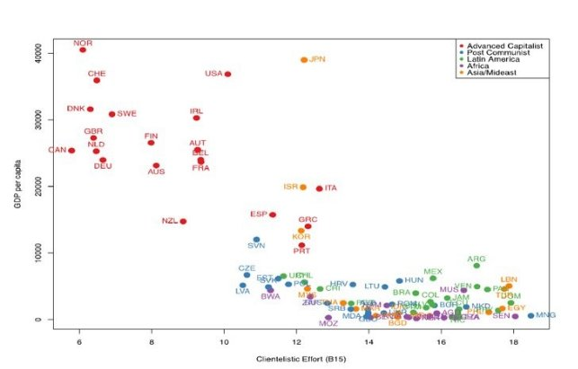

**PARTE 1.** 

Hemos elegido los países del sur de Europa que se democratizaron en la década de 1970 formando parte de lo que Samuel Huntington denominó la Segunda Ola Democratizadora: Portugal, España y Grecia.

***¿Cómo se ha comportado este indicador a lo largo del tiempo?*** 

Vemos en cada país cómo se ha comportado el indicador. 

**España**

El caso de España, en la gráfica podemos ver dos grandes descensos del índice de clientelismo que coinciden con las dos transiciones de dictadura a democracia: en 1931 y en 1978. Se puede apreciar también una reducción del clientelismo que, pese a ser una dictadura, implicaron las políticas de Primo Rivera a partir de 1924 situándose en valores similares a Grecia.

Respecto a la evolución del índice, destacaríamos los valores muy superiores a Portugal y Grecia en la primera década de siglo (superiores a 0,8) y la increíble reducción que se produjo en la Segunda República. En este periodo se llegó a valores que ninguno de los otros países analizados consiguió hasta sus transiciones en la década de 1970. Valores, en la España republicana similares a los 0,37 de EEUU, muy por encima de los 0,69 de Italia, aunque muy alejados de los 0,2 de Reino Unido o los 0,14 de Francia ( Ver *Gráfica 2*)

**Portugal**

En el caso de Portugal, vemos también un comportamiento idéntico con el triunfo de la Revolución de Los Claveles al que se produce con la Transición Española en 1974. Se aprecia también un leve descenso del clientelismo con la llegada de la república de 1910 que se mantiene hasta su fin en 1933.  Anteriormente se produce una leve reducción con valores por debajo del 0,7 a partir de 1932 coincidiendo con la entrada como Primer Ministro Salazar que se mantienen casi constante hasta 1962. Coincidiendo con el inicio de las guerras de descolonización el índice empieza a fluctuar.

**Grecia**

En el periodo de Dictadura de 1925 hasta el fin de la II Guerra Mundial, el índice oscila más que en España y Portugal, aunque la tendencia es claramente de incremento. Tras la Guerra Civil (1946-1949) con la llegada de la democracia se estabiliza alcanzando a valores inferiores a los otros dos países (por debajo del 0,5) hasta los últimos años que preceden a la Dictadura de los Coroneles. En esta nueva etapa, se produce un incremento (0,54) que se mantiene constante hasta la llegada de la Democracia en que, de forma análoga a España y Portugal, se produce una bajada brusca.

***¿Cuál es la tendencia?***

En líneas generales, podríamos aventurar algunas conclusiones sobre la tendencia general del índice de clientelismo en estos tres países desde principios del siglo XX.

1- La Democracia contribuye a desactivar más que erosionar el clientelismo. La Dictadura, no lo desactiva, aunque puede darse un leve deterioro o reducción.

2- La estabilidad política coincide con las etapas de valores constantes de clientelismo. La inestabilidad y los políticos coinciden con las variaciones y oscilaciones más bruscas.

3- Cuando en una etapa se dan valores o medias superiores a los existentes, estos nunca llegan a alcanzar de forma estable valores de etapas anteriores. No hay involuciones totales. 

4- La consecuencia de la anterior conclusión es que la tendencia general del clientelismo a lo largo del siglo en estos países (analizándolo completamente o por etapas) es a la baja. 

5- En la actualidad, Portugal es, de los tres, el que mejores resultados arroja y también mejor tendencia. Grecia aún tiene valores elevados si bien la tendencia es correcta y en España podría preocupar cierto incremento producido entre 2018 y 2020 en caso de repetirse.

*Gráfica 1: Comparativa del índice de clientelismo de los tres países del sur de Europa pertenecientes a la Tercera Ola Democrática.*

	*Fuente: https://v-dem.net/*

Detalle índice de clientelismo en la 2ª República Española. Comparación con Francia, EEUU e Italia.

*Fuente: https://v-dem.net/*

**PARTE 2.**

El siguiente gráfico presenta los datos de clientelismo político en varios países del mundo en función del PIB per cápita (datos de Kitschelt et al. 2010). ¿Qué podemos destacar del mismo? ¿Qué conclusiones podemos extraer?

Analizaremos por separado cada grupo de países para intentar obtener conclusiones de cada uno y del conjunto total.

En el grupo de países **capitalistas avanzados** existe menos clientelismo que en el resto. A su vez, es el grupo de Estados con mayores PIB. Dentro del propio grupo podemos diferenciar claramente un subgrupo conformado por Grecia, España, Portugal e Italia con menores PIB y más clientelismo que el resto de países capitalistas avanzados.

En definitiva, este grupo formado por Europa, EEUU, Canadá, Australia y Nueva Zelanda tienen unos índices de clientelismo inferiores a la media total y unos valores de PIB que superan la media excepto el subgrupo de Europa del sur mencionado que estarían con valores similares a la media mundial.

El grupo de **Asia y Oriente Medio** no es un grupo heterogéneo en cuanto al clientelismo, como tampoco lo es en lo que respecta al PIB. Dentro de este grupo, los países con menor PIB muestran unos valores de clientelismo superior a la media, pero también los valores de clientelismo de países ricos como Israel o Japón superan al grupo de capitalistas avanzados con valores similares a Portugal o Grecia.

En definitiva, los valores de clientelismo de este grupo quedan por encima de la media, aunque dentro del grupo, se da más clientelismo en los países con menor PIB.

El grupo de países **latinoamericanos** se caracteriza por tener un valor de PIB bastante por debajo de la media y unos niveles de clientelismo altos. Superando la media todos los Estados latinoaméricanos. Dentro de este grupo no se puede apreciar ninguna relación clara entre PIB y clientelismo. De hecho, podemos ver países con un índice de clientelismo similar y PIB bastante distinto (Argentina-Venezuela, México-Colombia...).

El grupo de países **postcomunistas** se caracterizan por tener un valor de PIB similar al de Latinoamérica, muy por debajo de la media, y unos índices de clientelismo medio-altos, muchos de ellos por encima de la media. Dentro del grupo no se puede apreciar una relación entre PIB y clientelismo demasiado clara. De hecho, podemos ver como dentro del grupo, Eslovenia presenta un mayor PIB y unos valores relativos de clientelismo buenos, pero es superada por Chequia y Letonia, países con una PIB muy inferior.

El grupo de países **africanos** se caracteriza por tener un valor de PIB inferior al resto de los grupos y un índice de clientelismo alto con la práctica totalidad de países por encima de la media. Dentro del grupo no se puede apreciar ninguna relación clara entre PIB y clientelismo. 

Como **conclusión general** podemos decir que hay una relación inversa entre el nivel de riqueza expresada en PIB de un país y el nivel de clientelismo. Consecuencia de esto es que, al plasmar en una gráfica ambos índices, quedan dibujadas las diferentes áreas económicas  mundiales en diferentes esquinas del gráfico coincidiendo gran parte de los países de Latinoamérica, África y excomunistas (los de menor PIB).

Ahora bien, es más difícil es establecer esta misma relación dentro de cada grupo. No obstante, sí que se podría diferenciar como otro grupo o subgrupo el conjunto de la Europa del sur con España, Italia, Portugal y Grecia del resto de países del grupo “capitalistas avanzados”. 

Como datos interesantes resaltaríamos las excepciones a la regla general de Canadá y Nueva Zelanda, por una parte, con índices de clientelismo mejores a los “esperados” y, el caso de Japón, por otra parte, con peores índices que países con un PIB similar.

4
